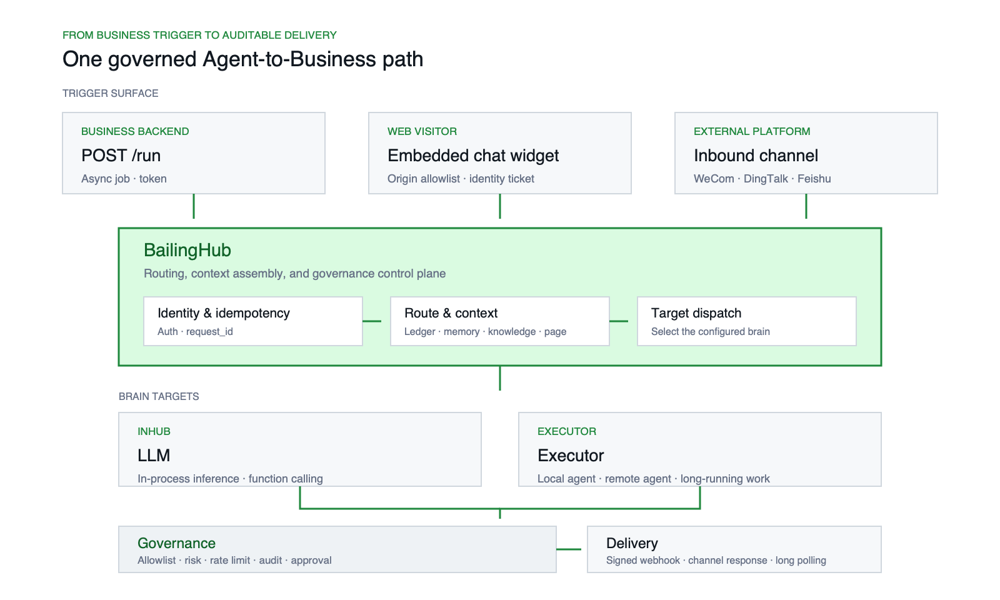

<p align="center">
  <picture>
    <source media="(prefers-color-scheme: dark)" srcset="assets/bailinghub-lockup-dark.png">
    
  </picture>
</p>

# BailingHub

**BailingHub** is an open-source A2B (Agent-to-Business) control plane built around [ACC, the Agent Capability Contract](https://www.agentcapability.org).

It lets you connect selected business actions to agents through OpenAPI/SDK tools and `x-agent-capability` metadata, while keeping routing, permissions, signatures, approvals, audit trails, traceability, and state ownership under your control.

ACC is the capability declaration contract for A2B: agents safely doing business work through existing systems. Its independent specification repository is [agent-capability/agent-capability-contract](https://github.com/agent-capability/agent-capability-contract). BailingHub adopts the ACC contract model, compiles capability declarations into unified `ToolDefinition` records, and enforces allowlists, risk levels, approvals, rate limits, signatures, and audit trails.

> Chinese documentation remains the most detailed reference. The first-release English path covers overview, quickstart, Docker demo, API contract, tools, and SDK integration.

## Why

Most existing business systems were not designed for A2B. Once an agent starts calling business APIs, teams quickly run into the same questions:

- Which business event should route to which agent or model?
- Which tools is the agent allowed to see?
- How do we prevent unsafe writes, over-permissioned tools, or accidental damage?
- Where do approval requests, audit trails, and trace logs live?
- How do we switch models or agent runtimes without rewriting business code?
- How do we let the business system remain the final authority for user permissions?

BailingHub puts these concerns into a self-hosted control plane.

## What It Is

BailingHub is:

- A self-hosted A2B control plane for existing systems.
- A governed tool runtime for OpenAPI/SDK business tools.
- A routing layer for `/run`, web chat widgets, and inbound channels.
- A runtime ledger for jobs, messages, approvals, audit events, and trace data.
- A way to let AI act on behalf of a real business user without bypassing your existing permission model.

BailingHub is not:

- Another chatbot.
- A generic low-code workflow engine.
- A replacement for your business backend.
- A replacement for MCP.

MCP solves tool discovery and invocation. BailingHub focuses on the business-side control plane around tools: routing, identity, risk, approval, audit, signatures, and traceability.

## Deployment Scope

The open-source edition is designed for a **single organization per deployment**. One hub can connect multiple business systems, clients, routes, and tool providers, but they share one management and audit boundary.

If you need to serve multiple isolated organizations, run separate hub deployments. Do not treat `client`, `route`, or `tool_provider` as an organization-level isolation boundary.

## 10-Minute Demo

> **Prefer to look around before installing?** Open the [online experience](https://trial.bailinghub.com/console/login), create an account, inspect the console, import demo data, and run diagnostics. This environment is for understanding the product and validating its configuration model. Do not upload production credentials or sensitive data, and do not connect real workloads. Self-host the open-source edition for actual use.

To validate the complete loop in your own environment:

```bash
docker compose up --build
```

Open:

```text
http://localhost:18900/console/
```

Login:

```text
admin / bailing-demo-admin
```

The demo starts:

- BailingHub hub
- MySQL
- A demo business app
- A demo tool provider
- A demo route
- A demo integration client
- Audit and trace flows

See [docs/DEMO.en.md](docs/DEMO.en.md) for the complete demo and [docs/QUICKSTART.en.md](docs/QUICKSTART.en.md) for the English quickstart.

## One-Line Install

For a fresh Ubuntu/Debian server:

```bash
curl -fsSL https://www.bailinghub.com/install.sh | sh
```

Use official prebuilt images:

```bash
BAILING_INSTALL_MODE=image curl -fsSL https://www.bailinghub.com/install.sh | sh
```

Use source mode for auditing or development:

```bash
BAILING_INSTALL_MODE=source curl -fsSL https://www.bailinghub.com/install.sh | sh
```

Global prebuilt images are published on GHCR:

```text
ghcr.io/bailinghub/bailinghub:<version>
ghcr.io/bailinghub/bailing-demo-business:<version>
```

```bash
BAILING_INSTALL_MODE=image \
BAILING_IMAGE_REGISTRY=ghcr.io \
BAILING_IMAGE_NAMESPACE=bailinghub \
BAILING_MYSQL_IMAGE=mysql:8.4 \
curl -fsSL https://www.bailinghub.com/install.sh | sh
```

An Aliyun ACR mirror remains the default for networks in China. Enterprise environments can override `BAILINGHUB_IMAGE`, `BAILING_DEMO_BUSINESS_IMAGE`, and `BAILING_MYSQL_IMAGE` with internal registries.

## How Business Tools Work

A business system publishes selected APIs as tools:

```text
/.well-known/bailing/tools.json
```

Tools can be declared by:

- OpenAPI with `x-agent-capability` extensions
- PHP SDK annotations
- PHP 7 builder SDK
- Node SDK
- Python SDK
- Java SDK
- Go SDK
- .NET SDK
- Future adapters such as MCP

The hub compiles those inputs into a unified `ToolDefinition`, then enforces:

- route allowlist
- risk level
- rate limits
- approval intent
- audit trail
- HMAC-signed tool calls
- on-behalf-of subject propagation

The business system still decides whether the user can actually perform the action.

```text
BailingHub controls reach.
Your business system controls authority.
```

## Minimal Tool Example

```js
import { buildOpenApiSpec, param, tool } from '@bailinghub/connect';

export default buildOpenApiSpec({
  title: 'CRM Tools',
  version: '1.0.0',
  authzProbe: { method: 'POST', path: '/.well-known/bailing/authz-probe' },
  tools: [
    tool({
      name: 'member_query',
      method: 'GET',
      path: '/api/members/{id}',
      description: 'Query member profile',
      scope: 'member.read',
      requiresSubject: true,
      params: [param('id', { in: 'path', required: true, description: 'Member ID' })],
    }),
  ],
});
```

## Typical Architecture

<picture>
  <source media="(prefers-color-scheme: dark)" srcset="assets/architecture-overview.en-dark.png">
  
</picture>

## Core Capabilities

| Capability | Description |
|---|---|
| Trigger routes | Route a business scenario to a model, executor, memory policy, knowledge base, tools, and delivery target. |
| Tool governance | Govern OpenAPI/SDK tools with allowlists, risk levels, rate limits, approvals, audit, and signatures. |
| Business authority | Tool calls carry `X-Bailing-On-Behalf-Of`; the business system keeps final permission control. |
| Runtime ledger | Jobs, messages, approvals, audit records, and trace data live in the hub state database. |
| Knowledge injection | Route-level knowledge retrieval before dispatch. |
| Web widget | Embed a zero-dependency chat widget into any web page. |
| SDKs | PHP, PHP 7, Node, Python, Java, Go, and .NET helper SDKs for tool specs, tickets, HMAC verification, authz probes, callbacks, and hub API calls. |
| Self-hosted | Run in your own environment with MySQL and Docker. |

## Documentation

- [Chinese README](README.md)
- [English Quickstart](docs/QUICKSTART.en.md)
- [Docker Demo](docs/DEMO.en.md)
- [HTTP Contract](docs/CONTRACT.en.md)
- [Business Tools and Governance](docs/TOOLS.en.md)
- [SDK Guide](docs/SDK.en.md)
- [English Documentation Map](docs/README.en.md)
- [Architecture](docs/ARCHITECTURE.en.md)
- [Pipeline](docs/PIPELINE.en.md)
- [Tool Model](docs/TOOLS_MODEL.en.md)
- [Tool Governance](docs/TOOLS_DESIGN.en.md)
- [AI-Friendly Tool Design](docs/AI_FRIENDLY_TOOLS.en.md)
- [Third-Party Integration](docs/INTEGRATION.en.md)
- [Release Notes](docs/RELEASE_NOTES_v0.1.0.en.md)
- [Compatibility And Upgrade Policy](docs/COMPATIBILITY.en.md)

## Feedback and Contributions

BailingHub `v0.1.0` is the first public release. We want its contracts and operational model to be tested against more real business systems, technology stacks, and industries. If a contract is unclear, integration is unnecessarily difficult, a security boundary needs scrutiny, or an important scenario is missing, please open a [bug report](https://github.com/bailinghub/bailinghub/issues/new?template=bug_report.yml), a [feature request](https://github.com/bailinghub/bailinghub/issues/new?template=feature_request.yml), or a pull request.

Useful reports include the business context, expected behavior, a minimal reproduction, and a sanitized trace. See [CONTRIBUTING.md](CONTRIBUTING.md) for contribution guidance.

## Open-Source Foundations and Third-Party Software

BailingHub adopts the open [Agent Capability Contract (ACC)](https://www.agentcapability.org), runs its service on Node.js and TypeScript, builds its console with Vue, Element Plus, and Pinia, and uses an independent MySQL service as the default persistent runtime.

ACC attribution is preserved in [NOTICE](NOTICE). The complete locked dependency, license, and external runtime inventory is recorded in [THIRD_PARTY_NOTICES.md](THIRD_PARTY_NOTICES.md).

## License

Apache License 2.0. See [LICENSE](LICENSE), [NOTICE](NOTICE), [THIRD_PARTY_NOTICES.md](THIRD_PARTY_NOTICES.md), [SECURITY.md](SECURITY.md), and [CONTRIBUTING.md](CONTRIBUTING.md).

The Apache License does not grant trademark rights to the names "BailingHub", "百灵中枢", or related marks. See [NOTICE](NOTICE).
