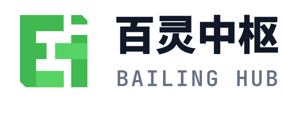
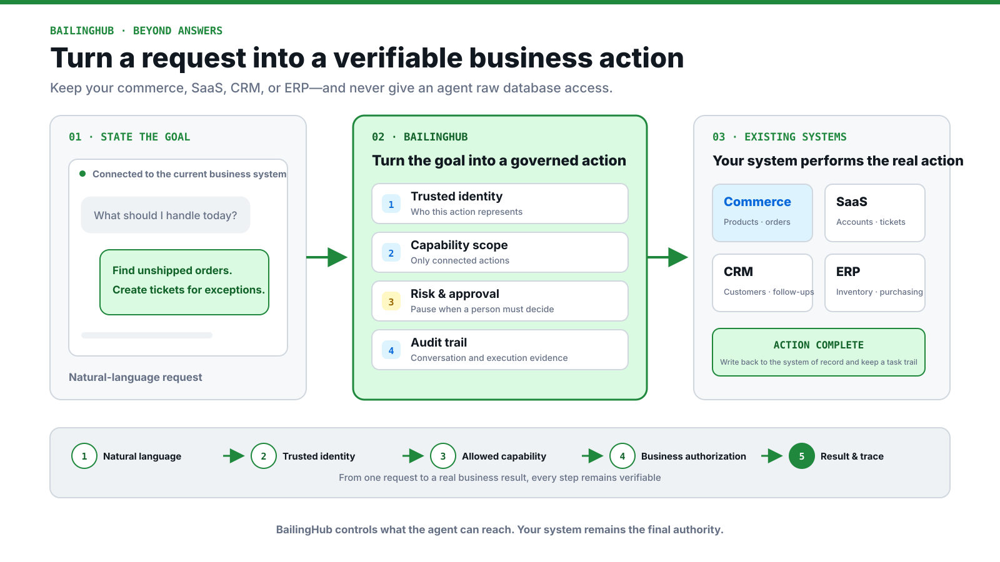
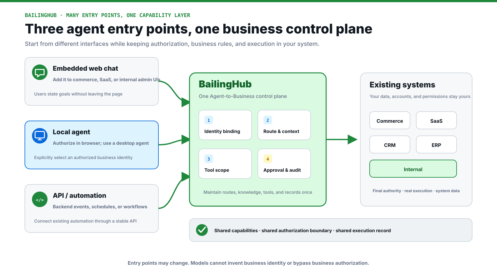
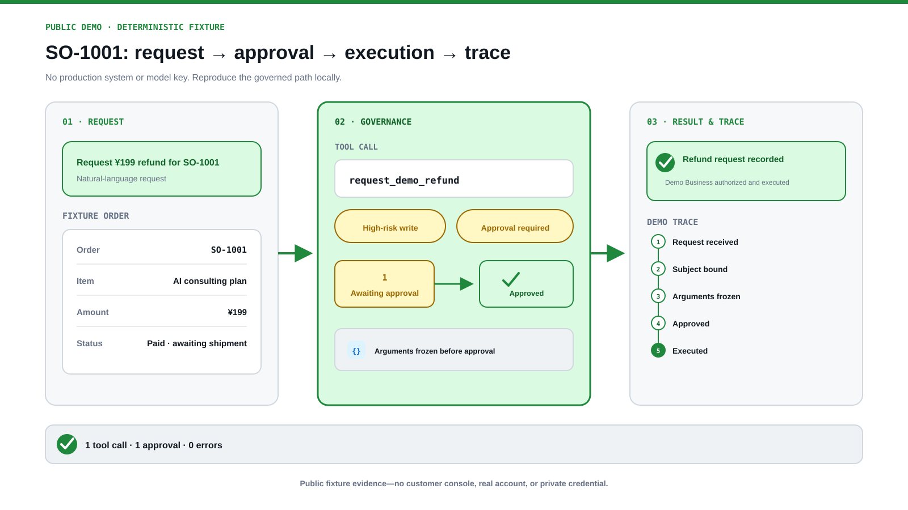
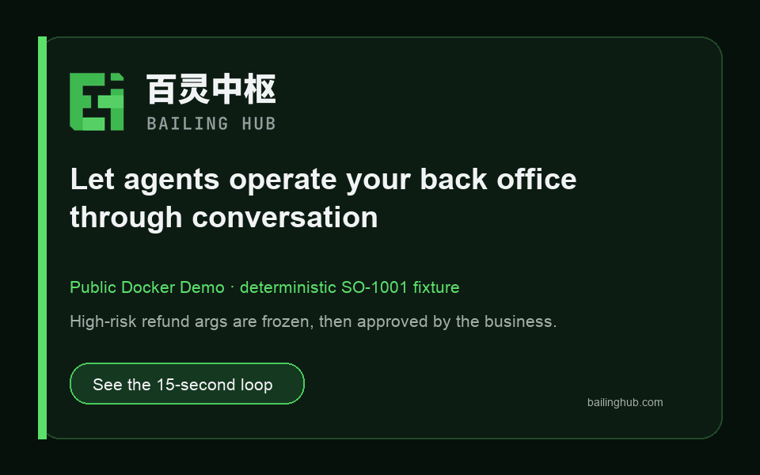

<p align="center">
  <picture>
    <source media="(prefers-color-scheme: dark)" srcset="assets/bailinghub-lockup-dark.png">
    
  </picture>
</p>

<p align="center">
  <a href="README.md">简体中文</a> · <strong>English</strong>
</p>

# BailingHub: Let Agents Operate Your Business System Through Conversation

BailingHub is open-source software that lets people operate an existing commerce, SaaS, CRM, or ERP system through conversation while keeping every action under control. A user can ask an agent to look up an order, update a staff profile, prepare an after-sales action, or complete another permitted workflow without learning every screen in the back office.

You choose which business APIs become available. BailingHub connects the conversation to those capabilities and keeps identity, permissions, approvals, signatures, execution records, and audit evidence under your control.

> **Let AI take over repetitive operations, not business authority.**

<p align="center">
  <a href="https://trial.bailinghub.com/register/"><strong>Try Online</strong></a>
  · <a href="docs/DEMO.en.md"><strong>Run the Demo</strong></a>
  · <a href="docs/QUICKSTART.en.md"><strong>Deploy BailingHub</strong></a>
  · <a href="docs/INTEGRATION.en.md"><strong>Connect Your System</strong></a>
</p>

<picture>
  <source media="(prefers-color-scheme: dark)" srcset="assets/readme-product-overview.en-dark.svg">
  
</picture>

## Operate the System by Conversation

Most business software already has the data, permission model, and APIs it needs. What it lacks is a safe bridge between a natural-language request and the exact operation the current user is allowed to perform.

BailingHub provides that bridge for scenarios such as:

| Team or system | Example conversational operations |
|---|---|
| Commerce operations | Find products, inspect inventory, query orders, or start an allowed after-sales action. |
| Customer service | Look up a member, summarize an order, check fulfillment, or collect the information needed for the next step. |
| SaaS administration | Query tenant-scoped data or update an allowed setting without bypassing the existing role model. |
| CRM and sales | Find a customer, review activity, add a permitted follow-up, or prepare a handoff. |
| Internal operations | Query staff records, update allowed profile fields, or run a governed administrative action. |
| Reporting | Ask for current business data and receive text, tables, a built-in follow-up form, or charts when the host registers a trusted renderer. |

These are integration patterns, not bundled access to a specific product. Your business system exposes the selected operations, and it remains the final authority on every call.

## Three Ways to Start a Conversation

<picture>
  <source media="(prefers-color-scheme: dark)" srcset="assets/readme-entry-points.en-dark.svg">
  
</picture>

### 1. Embedded assistant

Add the zero-dependency web widget to an existing back office, customer portal, or SaaS page. A signed visitor ticket can carry the trusted business identity, while page context helps the agent understand where the conversation started.

### 2. API, workflow, and channel clients

Use the versioned Client API and `/run` flow from your own application, Dify, n8n, an inbound channel, or another compatible client. The caller starts the task; BailingHub selects the configured route, context, tools, and delivery policy.

### 3. Local agent client

Let a desktop or CLI agent plan locally after browser authorization through the business system's existing login. BailingHub provides the permitted workspace and capabilities, then governs each invocation and records the visible result and execution trail.

The independent [BailingHub MCP Server](https://github.com/bailinghub/bailinghub-mcp-server) provides a host-neutral SDK and MCP surface. DeepSeek Harness users can install the independent community plugin [dsh-bailinghub](https://github.com/bailinghub/bailinghub-dsh-plugin). Neither package is part of the BailingHub Core distribution.

## The Simple Flow

```text
User or business event
        ↓
Widget / Client API / local Agent Client
        ↓
BailingHub route or Agent workspace
        ↓
Agent interprets, plans, and selects a permitted capability
        ↓
BailingHub checks identity, allowlist, risk, approval, and idempotency
        ↓
Signed request reaches the existing business API
        ↓
Business system rechecks current permissions and performs the operation
        ↓
Result, conversation, approval, audit, and trace evidence return to BailingHub
```

The model or agent runtime can change without becoming the source of business truth.

| Layer | Owns |
|---|---|
| Your business system | Accounts, tenants, roles, permissions, authoritative data, and final authorization. |
| BailingHub | Routes, capability projection, governed invocation, approvals, jobs, conversations, audit, and trace. |
| Agent or model | Understanding, planning, tool selection, and response generation inside the granted boundary. |
| ACC | The portable declaration of what a business capability means and how it should be governed. |

## A2B and ACC

**A2B (Agent-to-Business)** means letting an agent work through an existing business system on behalf of a real business subject, with controls suitable for business actions rather than only text generation.

[ACC, the Agent Capability Contract](https://www.agentcapability.org), is the open capability-declaration contract used by BailingHub. The independent specification repository is [agent-capability/agent-capability-contract](https://github.com/agent-capability/agent-capability-contract).

A business developer can describe an operation through OpenAPI `x-agent-capability` metadata or a BailingHub SDK. BailingHub compiles those declarations into unified `ToolDefinition` records and applies the configured allowlist, risk, approval, rate-limit, signature, and audit rules at runtime.

```text
ACC describes the business capability.
BailingHub governs when and how an agent may reach it.
The business system decides whether the current user may execute it.
```

## Run the Complete Demo

To explore before installing, use the [online experience](https://trial.bailinghub.com/register/). It is for understanding the product and configuration model only. Do not upload production credentials or sensitive data, and do not connect real workloads.

To run the complete disposable loop locally:

```bash
git clone --branch v0.5.1 --depth 1 https://github.com/bailinghub/bailinghub.git
cd bailinghub
export BAILING_TOKEN="${BAILING_TOKEN:-$(openssl rand -hex 32)}"
docker compose up --build
```

Open `http://localhost:18900/console/` and sign in with:

```text
admin / bailing-demo-admin
```

The demo starts BailingHub, MySQL, a sample business application, a tool provider, a route, and an integration client. Follow [Docker Demo](docs/DEMO.en.md) for the guided task or [Independent Validation](docs/INDEPENDENT_VALIDATION.en.md) to test the public path without maintainer-only instructions.

### Reproducible Execution Evidence

<picture>
  <source media="(prefers-color-scheme: dark)" srcset="assets/readme-demo-evidence.en-dark.svg">
  
</picture>

Everything in this visual comes from the repository's deterministic fixture, not a customer console. Running `npm run demo:e2e` creates the job, freezes the tool arguments, completes approval and execution, and writes reviewable trace evidence in the public demo.

### See the Governed Loop in 15 Seconds

The animation below was captured from this repository's public Docker demo. A natural-language refund request for deterministic order `SO-1001` is stopped before execution, sent to the sample business system with frozen arguments, approved there, executed, and recorded in Trace. It contains no customer console, real account, or production credential.



[Run the Docker Demo](docs/DEMO.en.md) · [Reproduce the independent validation](docs/INDEPENDENT_VALIDATION.en.md)

For a fresh Ubuntu or Debian server, the auditable installer uses official prebuilt images by default:

```bash
curl -fsSL https://www.bailinghub.com/install.sh | sh
```

Use [Quickstart](docs/QUICKSTART.en.md) for registry selection, source-mode installation, production secrets, MySQL, the first route, and upgrade checks.

## Connect an Existing System

Start with one small, well-understood read operation and one carefully governed write operation:

1. **Declare the operations.** Publish OpenAPI with `x-agent-capability`, or build the specification with the PHP, PHP 7, Node, Python, Java, Go, or .NET SDK.
2. **Establish identity at the entry point.** A signed widget ticket, trusted `/run` request, or Agent Auth approval binds the business subject when an operation requires one. The receiving API then verifies the BailingHub signature and rechecks the subject's current tenant, role, and permission.
3. **Register the tool provider and route.** Choose the model or executor, knowledge, memory, tool allowlist, approval policy, and delivery target in the BailingHub console.
4. **Choose an entry point.** Embed the widget, call the Client API, connect an automation platform, or authorize a local Agent Client.
5. **Verify the evidence.** Test one read, one permitted write, one denied action, approval when required, replay behavior, and the resulting audit and trace records.

The conventional tool manifest endpoint is:

```text
/.well-known/bailing/tools.json
```

The SDK helpers cover capability specifications, tickets, `sha256=` HMAC verification, authorization probes, callbacks, and Hub API calls. They do not replace your application's login or permission system.

## Safety and Authority Boundaries

- **The business system is the final authority.** When an operation requires an acting subject, `X-Bailing-On-Behalf-Of` carries the bound identity; the receiving API still verifies the signature and current permission before doing work.
- **Capabilities are projected, not assumed.** Every tool must be declared and pass the route allowlist and any subject requirement. Agent Client mode additionally intersects route, workspace, and Agent Session scope; its direct write tools use exact operation IDs and do not accept wildcards.
- **Approval cannot weaken business policy.** ACC metadata supplies the default risk and approval intent; BailingHub may add stricter approval requirements but cannot grant authority the business system did not provide.
- **Credentials have separate roles.** Business-backend Client Tokens do not enter the browser or local plugin. Agent authorization uses browser login, PKCE, short-lived access, refresh rotation, and revocable sessions.
- **Side effects are traceable.** Idempotency, frozen approval snapshots, audit events, task state, visible conversation messages, and tool traces support review and recovery. Hidden model reasoning is neither required nor stored.
- **Production secrets stay outside public configuration.** Use environment variables or a secret manager, restrict management access, configure retention, and test the pause switch before production use.

See [Security Policy](SECURITY.md), [Business Tools and Governance](docs/TOOLS.en.md), and [Agent Client v1](docs/AGENT_CLIENT_QUICKSTART.en.md) for the operational details.

## Deployment Scope

The open-source edition is designed for **one organization per deployment**. One hub may connect multiple business systems, clients, routes, and tool providers when they share one management and audit boundary.

Run separate BailingHub deployments for mutually isolated organizations. A `client`, `route`, `workspace`, or `tool_provider` is not an organization-level security boundary.

## Documentation

- [Quickstart](docs/QUICKSTART.en.md) — deploy and run the first route.
- [Docker Demo](docs/DEMO.en.md) — complete the sample business-operation loop.
- [Integration Guide](docs/INTEGRATION.en.md) — connect an existing application.
- [Agent Client v1](docs/AGENT_CLIENT_QUICKSTART.en.md) — browser authorization and local planning.
- [Business Tools and Governance](docs/TOOLS.en.md) — declare, sign, approve, and audit tools.
- [HTTP Contract](docs/CONTRACT.en.md) — stable network and identity boundaries.
- [Architecture](docs/ARCHITECTURE.en.md) — runtime layers and dependency direction.
- [English Documentation Map](docs/README.en.md) — the complete public documentation index.
- [Changelog](docs/CHANGELOG.en.md) and [v0.5.1 Release Notes](docs/RELEASE_NOTES_v0.5.1.en.md) — current release changes and upgrade notes.

## Feedback and Ecosystem

BailingHub is an early public project. If an integration is unclear, a safety boundary deserves scrutiny, or a scenario is missing, open a [bug report](https://github.com/bailinghub/bailinghub/issues/new?template=bug_report.yml), [feature request](https://github.com/bailinghub/bailinghub/issues/new?template=feature_request.yml), or pull request.

For one sanitized real API operation, use the [integration evaluation](https://github.com/bailinghub/bailinghub/issues/new?template=integration_evaluation.yml) form. It is a public pre-integration review, not hosted integration work, certification, or permission to connect production. Never include secrets, private hostnames, customer data, or a complete internal specification.

Independent distributions, industry adaptations, executors, connectors, and ACC implementations are welcome. A listing or compatibility reference is not certification, a service warranty, adoption by another project, or a transfer of maintenance responsibility. See [Community Derivatives and Ecosystem Collaboration](docs/ECOSYSTEM.en.md).

## Open-Source Foundations and License

BailingHub uses the open ACC contract, Node.js and TypeScript for the service, and Vue with Element Plus and Pinia for the console. Complete Docker and production deployments use an independent MySQL service for persistent runtime state; JSONL is for local smoke testing only. ACC attribution is preserved in [NOTICE](NOTICE); locked dependencies, licenses, and external runtimes are listed in [THIRD_PARTY_NOTICES.md](THIRD_PARTY_NOTICES.md).

Names such as Dify, n8n, MCP, OpenClaw, DeepSeek, and DeepSeek Harness identify compatibility targets or independent integrations only. They do not imply development, certification, adoption, or endorsement by the corresponding upstream projects.

BailingHub is licensed under the [Apache License 2.0](LICENSE). See [NOTICE](NOTICE), [THIRD_PARTY_NOTICES.md](THIRD_PARTY_NOTICES.md), [SECURITY.md](SECURITY.md), and [CONTRIBUTING.md](CONTRIBUTING.md). The license does not grant trademark rights to “BailingHub”, “百灵中枢”, or related marks.
