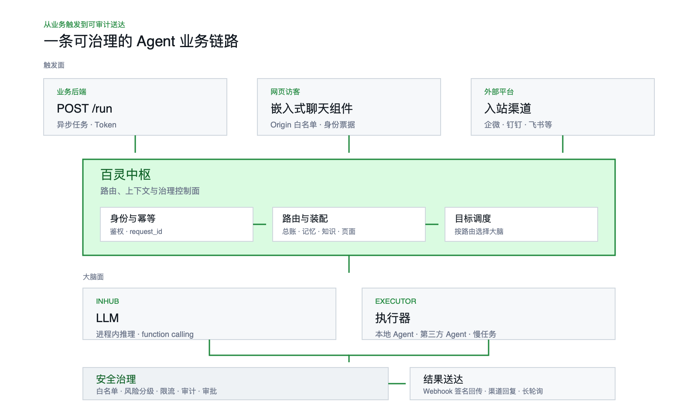

<p align="center">
  <picture>
    <source media="(prefers-color-scheme: dark)" srcset="assets/bailinghub-lockup-dark.png">
    
  </picture>
</p>

# 百灵中枢 · BailingHub

> **BailingHub** is an open-source A2B (Agent-to-Business) control plane built around [ACC (Agent Capability Contract)](https://www.agentcapability.org): connect OpenAPI/SDK tools to agents with routing, tool governance, approvals, audit trails, traceability, and self-hosted control.
>
> 中文文档是当前主文档；English documentation is available for the first-release path: [README.en.md](README.en.md), [docs/QUICKSTART.en.md](docs/QUICKSTART.en.md), [docs/DEMO.en.md](docs/DEMO.en.md), [docs/CONTRACT.en.md](docs/CONTRACT.en.md), [docs/TOOLS.en.md](docs/TOOLS.en.md), and [docs/SDK.en.md](docs/SDK.en.md). The public API, SDKs, schemas, Docker demo, and code identifiers are designed to be language-neutral.
>
> 生态接入：Direct Client API、Dify、n8n、MCP 与 OpenClaw 的统一入口见 [生态集成](https://www.bailinghub.com/integrations)。

业务系统的 **A2B 控制面**：一个独立部署、独立生命周期的服务，把「业务事件」与「Agent 大脑」用一条稳定的网络契约解耦开。业务侧只管**触发**（发任务 / 嵌聊天组件 / 接入站渠道），中枢负责**选大脑、装上下文、过安全闸、调业务工具、把结果送回**——大脑是 llm 还是远端执行器、用哪个知识库、带不带记忆，全在后台配置，业务无感。

A2B（Agent-to-Business）指“让 Agent 安全、可治理地接入已有业务系统，并代替真实业务主体查数据、办业务、走流程”。[ACC](https://www.agentcapability.org) 是 A2B 场景下的能力声明契约，独立规范仓库见 [agent-capability/agent-capability-contract](https://github.com/agent-capability/agent-capability-contract)；OpenAPI 绑定字段为 `x-agent-capability`。百灵中枢采用 ACC 的开放契约心智，把能力声明编译成统一 `ToolDefinition`，再执行白名单、风险、审批、限流、签名和审计。

> 一句话定位：**中枢是被业务「消费」的服务。业务挂了它不挂，它挂了业务无感。**
> 状态心智：**状态是王座，大脑是缓存**——对话总账（`bz_messages`）是唯一真值，大脑会话只是可重建的缓存。

## 为什么需要它

传统系统要做 A2B，通常会遇到同一组问题：不同入口怎么路由到不同大脑、Agent 怎么安全调用业务接口、审批和审计放在哪里、知识/记忆/页面上下文怎么注入、结果怎么可靠回传、未来换模型或换 agent 时业务代码要不要重写。BailingHub 把这些能力收敛成中枢服务和一组可配置插座，让业务系统保持原有边界，只通过 HTTP 契约接入。

In short: BailingHub is not another chatbot or agent framework. It is a self-hosted control plane that lets an existing system expose selected business actions to AI agents while keeping permissions, signatures, approvals, audit logs, and state ownership under the business system's control.

## 10 分钟体验

> **不想先部署？** 打开 [在线体验](https://trial.bailinghub.com/console/login)，注册后可直接查看控制台、导入演示数据并运行系统体检。该环境只用于了解产品和验证配置心智，请勿上传生产凭据、敏感数据或接入真实业务；正式使用请自行部署开源版。

需要在自己的环境验证完整闭环时：

```bash
export BAILING_TOKEN="${BAILING_TOKEN:-$(openssl rand -hex 32)}"
docker compose up --build
```

打开 http://localhost:18900/console/ ，用 `admin / bailing-demo-admin` 登录；demo 会自动创建中枢、MySQL、示例业务系统、工具源、路由和接入方。完整演示见 [docs/DEMO.md](docs/DEMO.md)，生产部署见 [docs/QUICKSTART.md](docs/QUICKSTART.md)。

开发者本地体检：

```bash
npm run doctor
```

愿意帮助验证“陌生开发者能否仅凭公开资料独立跑通”时，请按 [独立验证任务卡](docs/INDEPENDENT_VALIDATION.md) 完成非生产 Docker demo，并通过专用 Issue 模板反馈 PASS、部分通过或失败结果。无需接入真实业务，也不要提交任何生产凭据。

项目边界和长期取舍见 [VISION.md](VISION.md)；整体架构见 [docs/ARCHITECTURE.md](docs/ARCHITECTURE.md)。

<picture>
  <source media="(prefers-color-scheme: dark)" srcset="assets/architecture-overview.zh-CN-dark.png">
  
</picture>

## 这是什么、不是什么

- **是**：一个独立服务，只通过网络契约与业务对话（见 [docs/CONTRACT.md](docs/CONTRACT.md)）。状态进自己的库（`bz_` 前缀），不进业务库。
- **不是**：业务系统的一个模块。它不 import 业务代码，不跑在业务进程里。业务对它的依赖是**单向、异步、可降级**的。

## 部署范围

当前开源版按**单组织部署**设计。一套中枢可以接多个业务系统、多个接入方、多个路由和多个工具源，但它们属于同一个管理域和审计空间。

如果要服务多个互相隔离的独立组织，建议每个组织独立部署一套中枢；不要把 `client`、`route` 或 `tool_provider` 当作组织级隔离边界。

## 和 chatbot / workflow / MCP 的区别

- **不是普通 chatbot**：它不只回答问题，而是把业务触发、上下文装配、工具调用、审批、审计、送达和追溯收敛成一个可治理运行面。
- **不是传统 workflow**：它不要求业务把流程画死在编排器里；路由决定大脑、知识、记忆、工具白名单和送达策略，AI 在治理边界内动态执行。
- **不替代 MCP**：MCP 是工具协议生态；百灵中枢是业务侧 AI 控制面。独立的 [BailingHub MCP Server](https://github.com/bailinghub/bailinghub-mcp-server) 可把兼容客户端接入公共 Client API，仍由中枢负责身份、权限、风险、限流和审计。该适配器不进入 BailingHub 核心发行包。

## 能力面

| 能力 | 说明 | 文档 |
|---|---|---|
| **触发路由** | 业务场景 → 大脑/项目/会话策略/能力档/知识/记忆/工具/送达，一条路由配齐 | [CONTRACT §1](docs/CONTRACT.md) |
| **网页聊天组件** | 一行 `<script>` 嵌入；零依赖、Shadow DOM 隔离；外观可配（尺寸/位置/头像/气泡图标/打字机流式）；签名访客票据带可信身份 | [CONTRACT §1.1](docs/CONTRACT.md) |
| **入站渠道** | 外部平台消息直达中枢（企微被动回复 + 超窗异步推），`kind + config + route_key` 解耦 | [docs/CHANNELS.md](docs/CHANNELS.md) |
| **知识库** | 向量检索 + 派发前注入；业务推送入库 / 数据源连接器拉取入库 | [CONTRACT §2.1](docs/CONTRACT.md) |
| **工具插座** | Agent 安全调业务接口：OpenAPI `x-agent-capability` ACC 声明、四道闸（白名单/风险/限流/审计）、审批车道、`sha256=` 签名 | [docs/TOOLS_DESIGN.md](docs/TOOLS_DESIGN.md) |
| **对话记忆层** | 滚动摘要：水位线 + 异步增量结构化压缩，路由级可配（默认关） | [CONTRACT §1.1](docs/CONTRACT.md) |
| **页面上下文** | 网页访客在哪个页面提问 → 登记表寻址出页面语义注入 Agent 上下文 / 偏置知识检索 | [CONTRACT §1.1](docs/CONTRACT.md) |
| **对象存储** | 聊天图片落桶取永久 URL（追溯 / vision / 业务图片入参三用一份存储） | [CONTRACT §2.4e](docs/CONTRACT.md) |
| **控制台** | 上述全部 DB 驱动、后台可配、改完即生效；RBAC + 审计 | [docs/QUICKSTART.md](docs/QUICKSTART.md) |

## 快速上手

最快体验完整闭环（中枢 + MySQL + demo 业务系统 + 工具源）：

```bash
export BAILING_TOKEN="${BAILING_TOKEN:-$(openssl rand -hex 32)}"
docker compose up --build
```

`BAILING_TOKEN` 是管理 API 与派生签名凭证的根密钥。Docker Compose 不再提供公开默认值；请在同一终端保留该环境变量，或把随机值写入本机 `.env`。一键安装脚本会自动生成并保存强随机值。

全新 Ubuntu/Debian 服务器可用一键安装脚本快速体验；它只是把 Docker 安装、下载开源分发包、生成 `.env`、`docker compose up -d --build` 自动化，脚本内容在 [scripts/install.sh](scripts/install.sh) 可审计：

```bash
curl -fsSL https://www.bailinghub.com/install.sh | sh
```

一键安装默认使用官方预构建镜像，减少首次构建和 npm 安装耗时：

```bash
curl -fsSL https://www.bailinghub.com/install.sh | env BAILING_INSTALL_MODE=image sh
```

如需审计源码构建或做二次开发，可切到源码模式：

```bash
curl -fsSL https://www.bailinghub.com/install.sh | env BAILING_INSTALL_MODE=source sh
```

面向中国网络的默认镜像位于阿里云 ACR：

```text
crpi-xm97pbcjrmf5in3s.cn-shanghai.personal.cr.aliyuncs.com/bailinghub/bailinghub:<version>
crpi-xm97pbcjrmf5in3s.cn-shanghai.personal.cr.aliyuncs.com/bailinghub/bailing-demo-business:<version>
crpi-xm97pbcjrmf5in3s.cn-shanghai.personal.cr.aliyuncs.com/bailinghub/bailing-mysql:8.4
```

全球开发者也可以使用 GHCR：

```text
ghcr.io/bailinghub/bailinghub:<version>
ghcr.io/bailinghub/bailing-demo-business:<version>
```

```bash
curl -fsSL https://www.bailinghub.com/install.sh | env \
BAILING_INSTALL_MODE=image \
BAILING_IMAGE_REGISTRY=ghcr.io \
BAILING_IMAGE_NAMESPACE=bailinghub \
BAILING_MYSQL_IMAGE=mysql:8.4 \
sh
```

国内默认安装使用官方同步的 MySQL 8.4 镜像，不依赖 Docker Hub；GHCR 安装使用上游 `mysql:8.4`。企业环境可通过 `BAILINGHUB_IMAGE`、`BAILING_DEMO_BUSINESS_IMAGE` 和 `BAILING_MYSQL_IMAGE` 覆盖为内部镜像源。

打开 http://localhost:18900/console/ ，用 `admin / bailing-demo-admin` 登录；或按 [docs/DEMO.md](docs/DEMO.md) 直接用 curl 触发 `demo_support` 路由，跑通「业务系统暴露工具 → 中枢治理 → agent 调工具 → 审计」。

Docker demo 容器内可直接运行完整 smoke，默认会识别 `demo_support` 并检查 `/run + trace + 脱敏排障包`：

```bash
docker compose exec bailinghub npm run smoke
```

完整部署（MySQL + 控制台 + 路由/凭证/接入方）见 **[docs/QUICKSTART.md](docs/QUICKSTART.md)**。最小烟测（零外部依赖，本地 jsonl 状态）：

```bash
cd bailinghub
npm install
npm run doctor
npm run typecheck
npm run smoke                    # health / console / schema / 后台体检 / route=auto；有 demo token 时会跑 /run + trace
npm start                       # 默认 127.0.0.1:18900

# 另开终端：
curl localhost:18900/health
curl -X POST localhost:18900/run -H 'content-type: application/json' -d '{
  "request_id":"smoke-001",
  "project":"self",
  "source":"manual",
  "input":"README 描述的架构与 src 实现是否一致？有无明显实现缺口？"
}'
# 立即返回 {job_id,...}；稍后 curl localhost:18900/jobs/<job_id>
```

`project:"self"` 指向本仓自身，用于烟测「业务触发 → 大脑只读调查 → 结构化结论」整条链路。**网页聊天 / 路由 / 知识库 / 渠道等完整能力需 MySQL 后端**（`npm run db:init`）与控制台配置——见 QUICKSTART。

生产/远端烟测可指定地址和 token：

```bash
BAILING_SMOKE_URL=https://your-hub.example.com \
BAILING_SMOKE_TOKEN=<admin-token> \
npm run smoke

# 需要额外覆盖真实 /run + trace 时，再加：
BAILING_SMOKE_RUN_ROUTE=<route-key> npm run smoke
```

## 目录

| 路径 | 作用 |
|---|---|
| `docs/ARCHITECTURE.md` | **架构说明**：七层模型、通用性推演、解耦边界和扩展方向 |
| `docs/README.md` / `docs/README.en.md` | 文档地图：每类文档的职责边界与维护纪律 |
| `docs/user-guide/` | 使用者指南：面向业务负责人、产品经理、系统管理员和实施顾问，按业务场景说明为什么需要中枢、后台怎么配、配完交给开发者什么 |
| `docs/CONTRACT.md` | **边界契约**：`/run`、聊天入口、工具调用/签名、回送、降级、鉴权——业务与中枢唯一的「缝」 |
| `docs/CLIENT_API.md` | **生态接入稳定面**：版本化 Client API、机器契约、兼容规则与 Dify/n8n 跨仓门禁 |
| `docs/QUICKSTART.md` | 从零部署到第一条路由跑通的操作手册 |
| `docs/QUICKSTART.en.md` | English quickstart for Docker demo, first route, and first business tool |
| `docs/DEMO.md` | Docker Demo：20 分钟跑通 Agent 调业务工具闭环 |
| `docs/DEMO.en.md` | English Docker demo walkthrough |
| `docs/INDEPENDENT_VALIDATION.md` / `docs/INDEPENDENT_VALIDATION.en.md` | 陌生开发者仅凭公开资料完成非生产验证的中英文任务卡与客观通过标准 |
| `docs/CONTRACT.en.md` | English HTTP and wire contract summary |
| `docs/TOOLS.en.md` | English tool provider and tool governance guide |
| `docs/SDK.en.md` | English SDK guide for PHP, Node, Python, Java, Go, .NET, and any-language integration |
| `docs/integrations/dify/` | Dify 通过中枢控制面发起受治理任务的中英文最小接入配方与校验脚本 |
| `docs/TOOLS_MODEL.md` | **ACC 工具模型**：把 OpenAPI/SDK/Overlay/MCP 等来源统一成 Agent 工具治理抽象 |
| `docs/TOOLS_DESIGN.md` | 工具插座设计：四道闸、审批车道、渐进式披露、签名 |
| `docs/AI友好工具设计指南.md` | 开发者如何把老系统动作设计成 Agent 友好工具：最小接入、行业模板、风险选择 |
| `docs/*.en.md` | English companion docs for public open-source usage, architecture, tools, SDK, and compatibility |
| `docs/CHANNELS.md` | 入站渠道（企微等）接入说明 |
| `docs/CHANGELOG.md` | 发布记录：公开版本发布后，每次对外可见变更都在这里说明 |
| `docs/RELEASE_NOTES_v0.1.1.md` | `v0.1.1` 聊天组件运营控制与接入边界修复说明 |
| `docs/RELEASE_NOTES_v0.1.2.md` | `v0.1.2` 服务端根 token 与派生凭证安全加固说明 |
| `docs/RELEASE_NOTES_v0.1.3.md` | `v0.1.3` 便携式执行器接入与 OpenClaw 适配说明 |
| `docs/RELEASE_NOTES_v0.1.4.md` | `v0.1.4` 网页聊天真实流式输出与可重连 SSE 说明 |
| `docs/RELEASE_NOTES_v0.1.5.md` | `v0.1.5` 一键安装参数可靠性与全新服务器兼容性说明 |
| `docs/RELEASE_NOTES_v0.1.6.md` | `v0.1.6` 独立验证路径与安装后权限提示说明 |
| `docs/RELEASE_NOTES_v0.1.7.md` | `v0.1.7` 版本化 Client API 与跨生态兼容门禁说明 |
| `docs/RELEASE_NOTES_v0.1.8.md` | `v0.1.8` 首次管理员只创建一次与重启安全说明 |
| `docs/RELEASE_NOTES_v0.1.0.md` | 首个公开版本的发布说明 |
| `docs/兼容性与升级.md` | 版本发布策略：SemVer、稳定契约、数据库结构纪律、发布记录要求 |
| `sql/` | 中枢**独立**状态库 DDL（`bz_` 前缀，按序号演进）；数据库结构演进纪律见 [sql/README.md](sql/README.md) |
| `src/` | 服务端：入口/队列/调度/适配器/状态/知识/工具/记忆/页面上下文 |
| `web/widget/widget.js` | 可嵌入的网页聊天组件（零依赖单文件） |
| `web-admin/` | 控制台前端（Vue3 + Element Plus，构建产物落 `web/console/`） |
| `sdk/php` `sdk/php7` `sdk/node` `sdk/python` `sdk/java` `sdk/go` `sdk/dotnet` | 业务侧接入 SDK（工具注解 / spec 构建 + `sha256=` 验签 + callback 验签 + 票据签发 + authorize 探针 + HubClient，单一签名方案无版本分支） |
| `brain/` | executor 大脑配置：`agents/`(角色) `runbooks/`(排查清单) `profiles.json`(能力档)；定制走 `.local` 叠加层，见 [brain/README.md](brain/README.md) / [brain/README.en.md](brain/README.en.md) |

## 安全基线

- **输入即不可信**：业务/访客传入的正文被当作数据包裹，不作为指令执行。
- **生产密钥只走环境**：生产部署设置 `BAILING_ENV=production` 后，`server.token`、MySQL 口令、模型 API key、执行器 token、告警 webhook 等敏感项必须来自环境变量或密钥管理器；`config.json` 只保留非敏感结构配置或占位值。
- **鉴权分层**：接入方 token（挡公网扫描 + 路由白名单 + 限速）/ 管理 token / 任务级短凭证（`tool_token`，任务终态即失效）三者解耦；密钥列表只给掩码、完整值走显式 reveal + 审计。
- **集中限速账本**：MySQL 后端下，接入方限速、聊天入口 IP 限速、后台登录防爆破、工具源/工具级限速统一落到 `bz_rate_limits`，多进程/多副本共享同一套滑动窗口语义；jsonl 模式仅适合本地烟测。
- **审计留存显式配置**：`bz_audit` 默认不自动删除；生产按合规要求设置 `BAILING_AUDIT_RETENTION_DAYS` 后，中枢定期清理超龄审计并记录清理事件。
- **谁能做什么由业务裁决**：工具调用带 `X-Bailing-On-Behalf-Of` 主体并 `sha256=` 签名（把主体+任务钉进 HMAC），但「这个人此刻能不能做」由业务侧验签后按自家权限表裁决——Agent 调用与人点按钮走同一条裁决路径。页面上下文/访客 id 是**可伪造线索**，只作理解/检索提示，绝不用于鉴权。
- **写操作有闸**：`risk=high` / `confirm-required` 的工具不自动执行，先冻结调用快照并进入审批车道；生产环境推荐由业务侧审批流承接，中枢控制台作为兜底。批准后任务自动重跑，只放行与批准快照完全一致的那一次调用。
- **kill switch**：`POST /admin/pause` 或 `touch .paused` 立即停止受理新任务。

## 参与和反馈

BailingHub 当前公开版本仍处于早期验证阶段。我们希望它经得起更多真实业务系统、技术栈和行业场景的检验。如果你发现契约表达不清、接入过程繁琐、安全边界存在疑问，或有当前模型尚未覆盖的场景，欢迎提交 [Bug report](https://github.com/bailinghub/bailinghub/issues/new?template=bug_report.yml)、[Feature request](https://github.com/bailinghub/bailinghub/issues/new?template=feature_request.yml) 或 Pull Request。

如果你正在评估一个真实业务接口，但还没有准备好公开完整系统或开始部署，可以使用 [真实 API 接入评估](https://github.com/bailinghub/bailinghub/issues/new?template=integration_evaluation.yml) 模板：只提交一个脱敏后的 operation，以及行动主体、权限、审批或审计问题。它是公开的接入前技术评估，不是云托管、认证或代接生产系统；不要提交密钥、私有域名、客户数据或完整内部接口文档。

提出问题时，建议附上业务场景、预期行为、最小复现步骤和脱敏后的 trace；贡献方式见 [CONTRIBUTING.md](CONTRIBUTING.md)。

### 衍生项目与生态

我们欢迎社区创建独立发行版、行业适配、执行器、连接器和 ACC 独立实现。衍生项目可以保持自己的名称、方向与治理；通用改进欢迎回到上游，优秀的独立项目未来也可以申请在官方生态页面展示。展示不代表官方认证、商业担保或维护责任转移。完整原则见 [社区衍生与生态合作](docs/ECOSYSTEM.md)。

## 开源基础与第三方软件

百灵中枢采用开放的 [ACC（Agent Capability Contract）](https://www.agentcapability.org) 能力声明契约，服务端基于 Node.js / TypeScript，控制台基于 Vue / Element Plus / Pinia，默认使用独立的 MySQL 服务持久化运行状态。

ACC 归属信息已保留在 [NOTICE](NOTICE)；完整的锁定依赖、许可证和外部运行时说明见 [THIRD_PARTY_NOTICES.md](THIRD_PARTY_NOTICES.md)。

## License

Apache License 2.0. See [LICENSE](LICENSE), [NOTICE](NOTICE), [THIRD_PARTY_NOTICES.md](THIRD_PARTY_NOTICES.md), [SECURITY.md](SECURITY.md), and [CONTRIBUTING.md](CONTRIBUTING.md).

## 版本与发布记录

公开发布后，任何影响业务侧对接、wire 契约、数据库结构、SDK、控制台操作路径的变更，都会记录在 [docs/CHANGELOG.md](docs/CHANGELOG.md)。部署后可通过：

```bash
curl <中枢地址>/version
```

查看当前实例的应用版本、契约版本和数据库结构版本；后台「系统状态」页可查看数据库结构是否与当前代码一致。
