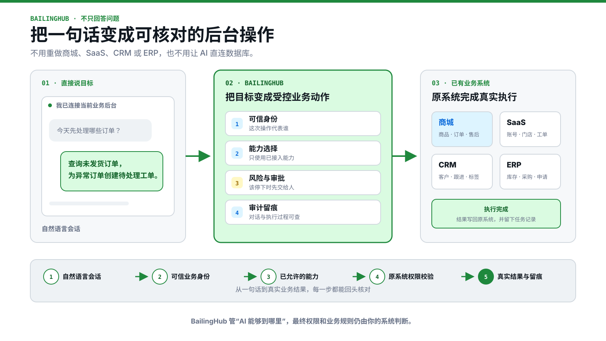
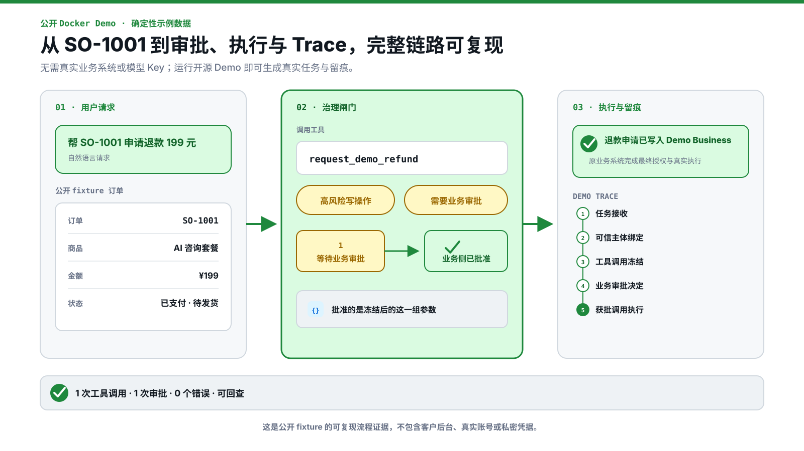
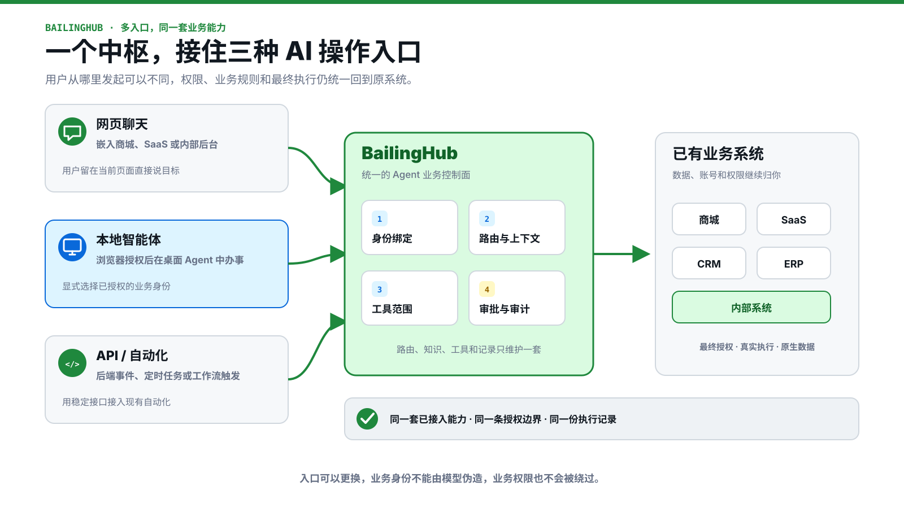
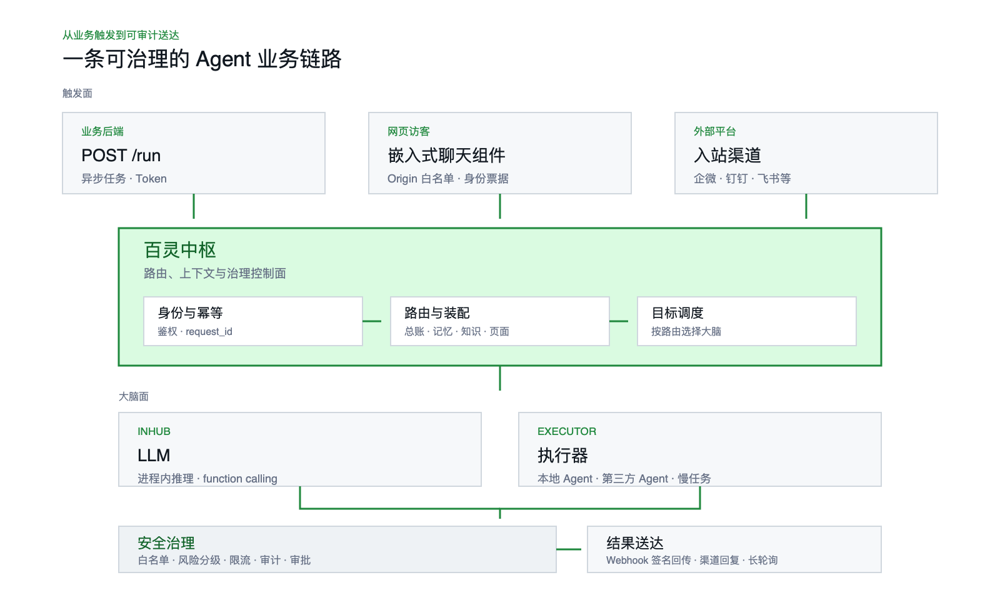

<p align="center">
  <picture>
    <source media="(prefers-color-scheme: dark)" srcset="assets/bailinghub-lockup-dark.png">
    
  </picture>
</p>

# BailingHub：让 Agent 通过对话操作你的业务后台

**BailingHub（百灵中枢）**是一个面向现有商城、SaaS、CRM、ERP 和内部管理系统的开源 Agent 业务执行中枢。

把“查订单、改资料、创建工单、发起审批”等你主动开放的后台能力接进来，用户就能从网页聊天窗、本地智能体或 Dify / n8n / MCP 等入口，用自然语言完成真实业务操作。BailingHub 负责身份绑定、能力范围、风险控制和全程审计；业务系统继续按原有权限做最终裁决。

> **接管操作，不接管权限。** BailingHub 不是模拟点击任意网页，也不会绕过你的后台权限；Agent 只能调用业务系统明确开放的接口，每次操作仍由业务系统检查身份和权限。

<p align="center">
  <a href="https://trial.bailinghub.com/register/"><strong>在线体验</strong></a>
  · <a href="docs/DEMO.md"><strong>运行 Docker Demo</strong></a>
  · <a href="docs/第三方对接指南.md"><strong>接入现有系统</strong></a>
  · <a href="README.en.md"><strong>English</strong></a>
</p>

<picture>
  <source media="(prefers-color-scheme: dark)" srcset="assets/readme-product-overview.zh-CN-dark.svg">
  
</picture>

在线体验环境只用于了解产品和配置方式。请勿上传生产凭据、敏感数据或接入真实业务；正式使用请自行部署开源版。

## 适合哪些团队

- 已有商城、SaaS、CRM、ERP 或内部后台，希望增加能查数据、办业务的 AI 助手。
- 已经在使用本地 Agent、MCP、Dify 或 n8n，希望复用一套业务身份、能力配置和审计记录。
- 需要自托管，并且不愿把业务密码、超级权限或全部接口直接交给模型。

如果业务系统没有可调用接口，也不准备增加薄适配层，BailingHub 不会把任意网站自动变成可操作系统。

## 它能用在哪里

| 已有系统 | 用户可以这样说 | 实际发生的事 |
|---|---|---|
| 商城 / SaaS 后台 | “查一下 SO-1001 的订单状态” | Agent 调用已授权的订单查询接口并返回实时结果 |
| CRM / ERP / 门店系统 | “把这位员工的联系电话改成新号码” | 中枢校验能力范围，业务系统再按当前用户权限决定是否修改 |
| 客服 / 运维后台 | “为这个订单创建一个售后工单” | Agent 生成参数、调用业务动作，结果写入对话与审计总账 |
| 退款 / 删除等高风险场景 | “为 SO-1001 申请退款 199 元” | 调用暂停并进入审批，批准后只执行获批的那次请求 |

开源 Demo 已内置**订单查询、售后工单、退款审批和故障 trace**，不需要真实业务系统或模型 Key 就能复现完整治理链路。接入你自己的系统时，可用的具体动作取决于你主动声明并实现了哪些业务接口；BailingHub 不会凭空获得后台能力。

### 公开 Demo 中可复现的执行证据

<picture>
  <source media="(prefers-color-scheme: dark)" srcset="assets/readme-demo-evidence.zh-CN-dark.svg">
  
</picture>

图中内容来自仓库内置的确定性 fixture，不是客户后台截图。运行 `npm run demo:e2e` 会在公开 Demo 中真实创建任务、冻结工具参数、完成审批与执行，并生成可回查的 trace。

## 三种入口，同一套业务能力

<picture>
  <source media="(prefers-color-scheme: dark)" srcset="assets/readme-entry-points.zh-CN-dark.svg">
  
</picture>

| 入口 | 适合谁 | 怎么使用 |
|---|---|---|
| **嵌入业务后台的聊天窗口** | 已有网站、商城或 SaaS | 粘贴一行 `<script>`；需要身份时，由业务后端基于现有登录态签发短票据 |
| **本地智能体 / 桌面客户端** | 希望从本机 Agent 直接操作业务的人 | 浏览器完成业务身份授权；本地 Agent 负责理解和规划，中枢提供受裁剪能力并记录执行轨迹 |
| **API 与生态平台** | 自有服务、Dify、n8n、MCP 客户端或消息渠道 | 通过稳定 Client API 或独立适配器接入，不必各自重做任务、审批和审计 |

三个入口可以同时存在。路由、知识库、记忆、业务身份、工具范围和审计仍在同一个中枢管理，不需要在每个 Agent 客户端里重复维护一套业务配置。

## 一次后台操作如何完成

1. **业务系统声明能力**：只开放准备交给 Agent 的查询、创建、修改或申请动作。
2. **用户建立可信身份**：网页聊天由业务后端基于现有登录态签发短票据；本地智能体则通过浏览器授权把 Agent Session 绑定到当前业务主体。两种方式都不传递业务密码和 Cookie。
3. **Agent 理解并选择工具**：中枢内置目标或本地 Agent 根据路由、上下文和可见能力生成参数。
4. **BailingHub 执行治理**：白名单、风险等级、限流、确认、审批和幂等规则在调用前生效。
5. **业务系统最终授权**：每次工具调用都按契约签名；需要主体的能力还会携带已绑定主体，业务后端仍按自己的租户、角色和业务规则执行或拒绝。
6. **全过程留痕**：消息、任务、工具调用、审批、结果和 trace 进入中枢自己的状态库；记录可追溯，Agent Session 可撤销，任务入口可暂停。

一句话概括：**BailingHub 决定 Agent 最多“够得到什么”，业务系统决定这个人此刻“能不能做”。**

## 为什么不只做一个聊天框或直接暴露 MCP

- **普通聊天框**解决对话界面，但通常不负责可信业务身份、写操作审批、调用签名和执行审计。
- **MCP**解决工具发现与调用协议；BailingHub 补上业务侧的能力裁剪、身份、风险、审批、限流和审计。两者可以配合使用。
- **传统工作流**适合画死的固定步骤；BailingHub 允许 Agent 在明确治理边界内动态选择工具，同时保留业务最终授权。
- **BailingHub 不替代业务后端**：它是独立控制面，不读取业务数据库，也不把 Agent 变成超级管理员。

## A2B 与 ACC

我们用 **A2B（Agent-to-Business）**描述“让 Agent 安全接入已有业务系统，并代表真实业务主体查数据、办业务、走流程”。

[ACC（Agent Capability Contract）](https://www.agentcapability.org) 是 A2B 场景下的开放能力声明契约，独立规范仓库位于 [agent-capability/agent-capability-contract](https://github.com/agent-capability/agent-capability-contract)。BailingHub 使用 ACC 的契约模型，把 OpenAPI / SDK 等来源编译成统一工具定义，再执行治理；OpenAPI 扩展字段为 `x-agent-capability`。

## 跑通完整闭环

在本机启动中枢、MySQL、Demo 业务系统、工具源、路由和接入方：

```bash
git clone --branch v0.5.1 --depth 1 https://github.com/bailinghub/bailinghub.git
cd bailinghub
export BAILING_TOKEN="${BAILING_TOKEN:-$(openssl rand -hex 32)}"
docker compose up --build
```

打开 <http://localhost:18900/console/>，使用 `admin / bailing-demo-admin` 登录。然后按 [Docker Demo](docs/DEMO.md) 运行订单查询和退款审批，观察“Agent 调工具 → 业务审批 → 结果回写 → 审计 trace”的真实链路。

```bash
docker compose exec bailinghub npm run smoke
```

全新 Ubuntu / Debian 服务器也可以使用可审计的一键安装脚本：

```bash
curl -fsSL https://www.bailinghub.com/install.sh | sh
```

该命令默认使用面向中国网络的官方 ACR 镜像 `crpi-xm97pbcjrmf5in3s.cn-shanghai.personal.cr.aliyuncs.com/bailinghub/bailinghub:<version>`。如果希望在本机从公开源码构建：

```bash
curl -fsSL https://www.bailinghub.com/install.sh | env BAILING_INSTALL_MODE=source sh
```

GHCR、生产环境变量和 MySQL 配置见 [快速开始](docs/QUICKSTART.md)。本地开发者还可以运行 `npm run doctor` 检查配置、文档与开源边界。

## 接入你自己的系统

建议先选择**一个低风险查询**和**一个需要治理的写操作**完成最小闭环：

1. 用 OpenAPI `x-agent-capability` 或 PHP / PHP 7 / Node / Python / Java / Go / .NET SDK 声明选定动作。
2. 在业务接口内验签；对于需要主体的能力，再用 `X-Bailing-On-Behalf-Of` 复用原有租户、角色和数据权限。
3. 在中枢登记工具源，配置触发路由、接入方、可见工具和需要审批的风险边界。
4. 从网页聊天、本地 Agent 或 Client API 发起真实请求，核对业务结果、审批和 trace。

第一次接入请直接阅读 [第三方对接指南](docs/第三方对接指南.md)；本地智能体接入见 [Agent Client v1 指南](docs/AGENT_CLIENT_QUICKSTART.md)，工具设计原则见 [AI 友好工具设计指南](docs/AI友好工具设计指南.md)。

## 核心能力

| 能力组 | BailingHub 提供什么 |
|---|---|
| **入口与路由** | `/run`、网页聊天、入站渠道和 Client API；按场景选择目标、会话策略、知识、记忆、工具和送达 |
| **业务能力接入** | OpenAPI / SDK / ACC 工具声明、能力搜索、读写范围裁剪和请求签名 |
| **Agent 上下文** | 知识库、滚动记忆、页面上下文、媒体与多模态输入策略 |
| **执行治理** | 白名单、风险分级、限流、确认、审批意图、幂等与不确定结果冻结 |
| **可信运行记录** | 对话总账、任务、工具调用、审批、审计、trace、成本与运行状态 |
| **管理与运维** | 自托管控制台、RBAC、智能体客户端与授权设备管理、远程撤销、暂停开关和健康检查 |

## 安全与部署边界

- **业务权限不外包**：中枢控制能力 Reach，业务后端控制最终 Authority；页面上下文和访客 ID 只作理解线索，不能用于鉴权。
- **输入默认不可信**：业务和访客正文按数据处理；生产密钥必须来自环境变量或密钥管理器，不能进入仓库、前端或 Agent 配置。
- **写操作有闸**：高风险或要求确认的工具先冻结调用快照并进入审批；批准后只放行与快照完全一致的那次调用。
- **随时可以叫停**：`POST /admin/pause` 或 `touch .paused` 会停止受理新任务。
- **状态独立保存**：完整 MySQL 部署把消息、任务、审批和审计写入中枢自己的 `bz_` 状态表，不写入业务数据库；JSONL 仅用于本地烟测。模型或执行器的运行时会话可以重建，Agent Session 则是可撤销的持久授权记录。
- **开源版按单组织部署**：一套中枢可接多个业务系统、路由和工具源，但共享一个管理与审计边界；互相隔离的组织应分别部署。
- **这是接口治理，不是浏览器 RPA**：业务系统需要提供选定接口、验签和最终授权；BailingHub 不会直接导入业务代码或接管任意网页。

完整威胁模型、漏洞报告方式和生产建议见 [SECURITY.md](SECURITY.md) 与 [工具治理设计](docs/TOOLS_DESIGN.md)。

## 架构与项目边界

<picture>
  <source media="(prefers-color-scheme: dark)" srcset="assets/architecture-overview.zh-CN-dark.png">
  
</picture>

BailingHub Core 是独立服务，只通过稳定网络契约与业务系统协作。[BailingHub MCP Server](https://github.com/bailinghub/bailinghub-mcp-server) 是独立生态适配层；[dsh-bailinghub](https://github.com/bailinghub/bailinghub-dsh-plugin) 是 DeepSeek Harness 的独立社区插件。它们消费 Core 的公共接口，不进入 Core 发行包，也不代表对应上游项目的开发、认证或背书。

## 文档导航

| 我想做什么 | 从这里开始 |
|---|---|
| 看懂产品和控制台 | [用户指南](docs/user-guide/README.md) |
| 部署完整开源版 | [快速开始](docs/QUICKSTART.md) |
| 跑通公开 Demo | [Docker Demo](docs/DEMO.md) |
| 接入现有业务 | [第三方对接指南](docs/第三方对接指南.md) |
| 接入本地智能体 | [Agent Client v1 指南](docs/AGENT_CLIENT_QUICKSTART.md) |
| 查 API 与边界契约 | [HTTP 契约](docs/CONTRACT.md) · [Client API](docs/CLIENT_API.md) |
| 理解架构与长期取舍 | [架构](docs/ARCHITECTURE.md) · [项目愿景](VISION.md) |
| 查看版本变化 | [CHANGELOG](docs/CHANGELOG.md) · [v0.5.1 Release Notes](docs/RELEASE_NOTES_v0.5.1.md) |

完整中英文文档地图见 [docs/README.md](docs/README.md)。公共 API、SDK、Schema、Docker Demo 与代码标识保持语言中立。

## 参与和反馈

BailingHub 仍处于早期公开验证阶段。欢迎提交 [Bug report](https://github.com/bailinghub/bailinghub/issues/new?template=bug_report.yml)、[Feature request](https://github.com/bailinghub/bailinghub/issues/new?template=feature_request.yml) 或 Pull Request。

如果你正在评估一个真实业务接口，但暂时不能公开完整系统，可使用 [真实 API 接入评估](https://github.com/bailinghub/bailinghub/issues/new?template=integration_evaluation.yml) 模板，只提交一个脱敏 operation 和身份、权限、审批或审计问题。不要提交密钥、私有域名、客户数据或完整内部接口文档。贡献规范见 [CONTRIBUTING.md](CONTRIBUTING.md)。

我们欢迎独立发行版、行业适配、执行器、连接器和 ACC 独立实现。衍生项目可以保持自己的名称、方向与治理；展示不代表官方认证、服务担保或维护责任转移，详见 [社区衍生与生态合作](docs/ECOSYSTEM.md)。Dify、n8n、MCP、本地 Agent 与其他入口见 [生态集成](https://www.bailinghub.com/integrations)。

## 开源与许可证

BailingHub 服务端基于 Node.js / TypeScript，控制台基于 Vue / Element Plus / Pinia；完整 Docker 和正式部署使用独立 MySQL 持久化运行状态，JSONL 仅用于本地烟测。ACC 归属信息保留在 [NOTICE](NOTICE)，完整锁定依赖、许可证与外部运行时清单见 [THIRD_PARTY_NOTICES.md](THIRD_PARTY_NOTICES.md)。

Apache License 2.0. See [LICENSE](LICENSE), [NOTICE](NOTICE), [THIRD_PARTY_NOTICES.md](THIRD_PARTY_NOTICES.md), [SECURITY.md](SECURITY.md), and [CONTRIBUTING.md](CONTRIBUTING.md).

部署后可通过 `GET /version` 查看应用版本、契约版本和数据库结构版本；所有影响业务接入、wire 契约、数据库结构、SDK 与控制台路径的变更记录在 [docs/CHANGELOG.md](docs/CHANGELOG.md)。
