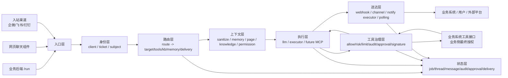

# 百灵中枢架构说明

> 面向传统业务系统的 AI 接入中枢：把业务事件、聊天入口、渠道消息、AI 大脑、业务工具、权限治理、审计追踪和结果送达放到一条稳定的网络契约里。

本文用于说明百灵中枢的整体架构。它不是 API 细节手册，而是回答四个问题：

1. 这个框架到底解决什么问题；
2. 每一层负责什么，边界在哪里；
3. 它对不同行业、不同技术栈是否具备通用性；
4. 当前还有哪些散点、风险和下一步优化方向。

相关细节文档：

- `README.md`：项目定位与快速入口；
- `docs/CONTRACT.md`：业务系统与中枢之间的网络契约；
- `docs/TOOLS_MODEL.md`：ACC / Agent 调业务能力的统一工具治理模型；
- `docs/TOOLS_DESIGN.md`：工具源、签名、审批、审计与威胁模型；
- `docs/QUICKSTART.md`：从部署到第一条业务接入。

## 1. 定位

百灵中枢不是“又一个 Agent 框架”，也不是业务系统里的一个模块。它更接近：

```text
Business AI Gateway / AI Dispatch Hub / Legacy System AI Middleware
```

它服务的核心场景是：一个已经存在的业务系统，希望快速、安全、可审计地接入 AI 能力。

传统系统要具备 AI 操作能力，最终都绕不开这些工作：

- 接收业务事件或用户消息；
- 判断这条请求该给哪个模型、哪个智能体、哪个执行器；
- 给 AI 装配业务上下文、知识库、历史对话；
- 把业务接口包装成 Agent 可调用工具；
- 传递“这次操作替谁发起”的身份；
- 对工具调用做白名单、风险分级、限流、审计、审批；
- 处理异步任务、超时、重试、回调和结果送达；
- 留下可追溯记录，方便排障和追责；
- 允许模型、渠道、工具、存储、执行器持续替换。

如果没有中枢，开发者通常会把这些能力分散写在业务项目里：一个队列表、一个回调脚本、一段 prompt 拼接、几个模型 key、一些临时权限判断、一个后台配置页。短期能跑，长期会形成多个业务系统各自一套 AI 接入逻辑，难以治理、难以复用、难以审计。

百灵中枢的价值是把这些“传统系统 AI 化时必然出现的基础设施”抽成一层独立服务。

## 2. 设计原则

### 2.0 部署范围

当前开源版按单组织部署设计。一套中枢可以接多个业务系统、多个接入方、多个路由和多个工具源，但它们共享同一个管理域和审计空间。

如果要服务多个互相隔离的独立组织，建议每个组织独立部署一套中枢；`client`、`route`、`tool_provider` 不是组织级隔离边界。

### 2.1 业务与 AI 解耦

业务系统只通过 HTTP 契约消费中枢，不 import 中枢代码；中枢也不 import 业务代码。业务挂了不拖垮中枢，中枢挂了业务可降级到人工流程。

### 2.2 状态归中枢，大脑可替换

对话总账、任务、审计、审批、送达记录放在中枢状态库里。模型会话、外部执行器上下文只是缓存。缓存丢了可以从总账重新装配。

### 2.3 身份由可信业务侧确立

中枢不替业务系统判断“这个人有没有权限”。中枢只把可信主体通过 `On-Behalf-Of` 传给业务工具，业务侧验签后用自己的权限表裁决。

### 2.4 工具治理在中枢，业务授权在业务

中枢管 reach：这条路由最多能让 Agent 够到哪些工具、风险多高、是否需要审批、调用是否审计。

业务管 authority：这个主体此刻能不能对这个资源执行这个动作。

### 2.5 插座化，而不是平台锁死

入口、渠道、大脑、执行器、工具源、送达、存储、模型凭证都应该是插座。核心只认标准信封和内部抽象。

## 3. 总体链路



## 4. 八层模型

### 4.1 入口层

入口层回答：请求从哪里来？

当前入口：

- `POST /run`：业务后端主动触发，适合工单、订单、告警、审核、运营动作；
- 网页聊天组件：任意网页嵌一行 script，适合客服、导购、帮助中心、后台助手；
- 入站渠道：企微等外部平台回调进中枢，适合 IM、协作软件、客服会话；
- 管理入口：控制台和 admin API；
- `launch-runtime`：入口闸门之后的统一落单层，负责输入清洗、thread 解析、会话背压、初始 dispatch 快照，以及远端执行器/本地串行执行的启动分流。

通用性推演：

- 电商：订单异常、售后咨询、商品配置、营销活动诊断；
- SaaS 后台：客户问题调查、配置检查、报表解释、自动生成工单；
- CRM：客户跟进建议、商机摘要、自动查客户画像；
- OA/ERP：审批说明、库存/采购查询、合同资料问答；
- 运维/AIOps：告警调查、日志归因、变更风险分析；
- 教育/医疗/金融等强监管行业：更需要入口限速、身份传递、审计和业务侧审批。

扩展点：

- 新 HTTP 入口：保持最终落到统一 route；
- 新渠道：实现平台握手、解密、消息规范化，再绑定 `route_key`；
- 新前端组件：只要能发标准聊天信封即可；
- 批处理入口：定时器、webhook、MQTT、事件总线都可以作为入口。

当前问题与优化：

- 不同入口的身份语义需要统一成更清晰的 Principal 模型；
- 入站渠道目前以企微为主，平台 handler 和核心路由分发需要更明确的 adapter 边界；
- 开源版本需要 demo 入口，避免用户一上来就配置真实业务系统；
- 入口 trace 需要展示 `launch-runtime` 的关键决策：thread 是否解析成功、是否触发会话背压、远端任务是否已完成上下文快照、本地任务是否进入串行道。

### 4.2 身份层

身份层回答：这次请求是谁发起的，替谁服务？

当前能力：

- `bz_clients`：业务系统接入方 token、路由白名单、限速；
- visitor ticket：网页登录用户由业务后端签短票，中枢验签后写入可信 uid；
- 入站渠道主体：企微等平台解密后的成员 ID；
- `subject_field`：路由工具调用时，从 metadata 中取操作主体；
- `X-Bailing-On-Behalf-Of`：中枢调用业务工具时把主体钉进签名。

通用性推演：

传统业务系统的身份体系差异很大：PHP session、JWT、企微 userid、会员 uid、员工工号、租户用户表。中枢不应该强行接管身份系统，而应该接收业务侧已确认的主体声明，并把它安全传递到工具调用链路里。

扩展点：

- `Principal` 抽象：把 `visitor_uid`、`wecom_userid`、`operator_uid` 等归一；
- 多渠道身份映射：同一人可能同时是企微成员、后台账号、C 端会员；
- audience 策略：不同主体类型能走不同路由、模型、预算、工具范围；
- OAuth/OIDC：面向公开第三方生态时可选，不应成为传统系统接入前置条件。

当前问题与优化：

- 身份归一还没有完全产品化，当前更多依赖 metadata 约定；
- `subject_field` 很灵活，但外部开发者需要更清晰的配置向导和失败提示；
- 匿名访客、登录用户、员工渠道用户的权限差异需要在控制台里更直观；
- 开源文档必须反复强调：中枢认证调用来源，业务侧最终授权。

### 4.3 路由层

路由层回答：这个场景该怎么处理？

当前能力：

- route 绑定 target、project/profile、会话策略、知识库、记忆、工具、送达、重试；
- 接入方只能调用白名单 route；
- route 把入口和执行目标解耦：同一个入口可以换大脑，同一个大脑可以服务多个场景。

通用性推演：

传统系统里“AI 能力”不应该是一个全局开关，而应该按业务场景配置。客服问答、售后调查、财务审核、门店运营、代码调查、告警诊断，它们需要不同模型、不同工具、不同权限、不同送达。

扩展点：

- route template：为常见场景提供模板，比如客服 FAQ、订单查询、工单调查；
- route=auto：先分诊再落到具体 route；
- route versioning：重要生产场景需要灰度和回滚；
- audience policy：按主体、租户、渠道、风险等级选择车道；
- `budget-runtime`：按 route/client 的预算策略在入口落单前做硬限检查，窗口内成本或 token 已达上限时直接生成 `rejected` job 和审计，不进入模型/执行器/工具链路。

当前问题与优化：

- route 承载能力较多，需要拆出更清晰的 schema；
- 控制台配置需要“场景向导”，而不只是裸 JSON；
- route 决策过程需要进入 job trace，方便解释为什么走了这个目标和这些工具；
- 如果未来扩展平台级隔离，route 与 client 的作用域边界需要在仓储和查询入口统一收紧。

### 4.4 上下文层

上下文层回答：AI 在执行前到底应该看到什么？

当前能力：

- 清洗用户输入中伪造的系统栅栏，防止用户跳出任务包裹或伪造知识/会话块；
- 从对话总账装配会话背景，支持最近逐字尾巴和可选滚动摘要；
- 注入当前页面线索，帮助 AI 理解用户此刻所在业务场景；
- 按 route.knowledge 检索知识库，并生成可回溯的 `kb_refs`；
- 按 permission 注入只读/可写等权限约束；
- 从用户原始输入提取图片，避免把知识库截图误当成用户图片。

通用性推演：

传统系统接 AI 时，真正困难的往往不是“调模型”，而是“这一轮应该给模型什么”。同一个用户问题，在订单页、商品页、工单页、审批页的语义可能完全不同；同一个 AI 回复，也必须结合历史对话、知识库、身份和权限约束。上下文层把这些装配动作变成可测试的流水线，避免散落在业务代码和 prompt 字符串里。

扩展点：

- business scope context：注入业务范围、组织或租户线索，但不替代业务授权；
- user profile context：注入用户画像、角色、偏好，但不替代业务授权；
- domain policy：按行业注入合规提示、风险边界、术语表；
- attachment parser：把图片、文件、表格统一解析为模型可消费资产；
- prompt guard：在上下文边界处统一做注入防护和敏感信息处理；
- RAG rerank：把知识检索和重排做成可替换策略。
- `summary-runtime`：把滚动摘要从任务引擎拆出，独立负责触发阈值、水位推进、LLM 摘要、CAS 竞争审计和同线程并发去重；生产部署可复用 `bz_runtime_locks` 做跨实例摘要去重，避免多副本重复消耗摘要 LLM。

当前问题与优化：

- 上下文装配顺序已经代码化，但控制台和 trace 里还没有直观呈现；
- 页面上下文和知识检索的关系需要进一步产品化，例如页面标签加权、行业模板；
- 权限前置目前是 prompt 约束，执行器硬沙箱仍应由执行器侧负责；
- 未来需要把 context trace 作为 job trace 的一个阶段，解释本轮注入了哪些信息、哪些信息因错误降级。
- 记忆摘要当前是进程内去重 + 运行期短租约锁 + DB CAS：锁负责减少重复 LLM 调用，CAS 负责水位写入最终正确；若未来要严格削峰/延迟调度，可再把摘要升级为任务队列。

### 4.5 执行层

执行层回答：谁来真正完成任务？

当前执行目标：

- `llm`：中枢进程内模型调用，适合秒级问答、工具调用、轻量任务；
- `executor`：远端执行器长轮询认领，适合本地脚本、内网智能体、第三方 agent、慢任务；
- 目标注册表：让大脑成为可配置插座，而不是写死在业务里；仓储由 `server` 组合根显式注入，registry 不反向依赖 runtime 单例。
- `inhub-runtime`：收口进程内目标的启动、条件认领、重跑、boot/stale 恢复和 retry 计时，避免这些可靠性细节继续散在 engine 中。
- `state.updateJobIfStatus`：提供状态层条件更新，`llm` 执行前只允许 `queued -> running`，恢复/重燃只允许从刚读到的状态回到 `queued`，避免任务已完成后被旧实例倒回重跑。
- `state.claimNextJob/claimNextInhubJob`：统一 DB 认领模型，认领时写入 `claimed_at`、`lease_until`、`claim_token` 和 owner；`run_after` 未到期不认领，同 `thread_id` 已有在途任务或前序可运行 queued 任务时不认领后序任务。
- `state.acquireRuntimeLock/releaseRuntimeLock`：提供运行期短租约锁，inhub 会话串行道在进程内 FIFO 之外叠加 `serial:<thread_id>` 跨实例互斥；实例崩溃后租约过期可被新实例接手，正常完成主动释放。
- `execution-runtime`：统一准备 adapter 上下文，包括 target config、运行期凭证、工具治理句柄、内置发送能力、超时和 retry 决策。

通用性推演：

不同团队已有不同 AI 基础设施：OpenAI 兼容模型、自建模型、n8n workflow、Python agent、Java 后台任务或其他本地执行器。中枢不应强迫用户换掉已有智能体，而应给它们一个统一的任务信封、工具代理和结果回报协议。

扩展点：

- 新 LLM provider adapter；
- 新 executor runner；
- Python/Node/Java 执行器 SDK；
- MCP 出站：中枢作为带治理的 MCP client；
- MCP 入站：把中枢工具投影给外部 MCP client；
- 多副本执行和能力上报。

当前问题与优化：

- llm 进程内执行的点火/重跑/恢复已收口到 `inhub-runtime`，并已接入 DB 认领、job 租约和 per-thread 队头约束；多副本下同 job 不会被重复执行，同 thread 不会并发执行，且后序任务不会越过同 thread 的前序可运行任务；
- executor 协议已经成型，但 SDK 和示例需要补齐；
- 执行器能力、健康状态、并发、版本需要更明确地进入控制台；
- 开源版本应避免让用户误以为必须使用某个特定 agent 运行时。
- 执行层 trace 还应进一步细化，明确记录 target config 解析、工具锁定、retry 计划等关键决策。

### 4.6 工具治理层

工具治理层回答：Agent 可以调用哪些业务能力，如何安全调用？

这是当前项目最有通用价值的一层。

更完整的工具抽象见 `docs/TOOLS_MODEL.md`。本节只说明它在整体架构中的位置。

当前能力：

- 首发公开契约采用 ACC（Agent Capability Contract），OpenAPI 绑定字段为 `x-agent-capability`；
- 业务参数继续走标准 JSON Schema；ACC 只声明 Agent 触达边界、风险、审批、审计、限流和模型提示语义；
- 未知 `x-agent-capability` 字段会被忽略；operation 上的 `x-bailing-*` / `x-business-*` 进入扩展袋但不隐式改变安全闸门；
- `ToolDefinition` 已有代码模型与机器可读 schema，编译器统一返回 `diagnostics`，控制台的 skipped / warnings 只是展示派生；
- 路由 allow 白名单控制工具暴露范围；
- 风险分级：readonly/low/medium/high/confirm-required；
- 限流：路由和工具维度；
- 审计：每次工具调用留痕；
- 审批车道：高风险调用撤单并冻结快照，审批决策可由业务系统、IM/OA 流程或中枢控制台兜底承接，批准后按快照重跑；
- 签名：`sha256=` HMAC，把 method、path、body hash、subject、job_id 钉住；
- `tool_token`：任务级短凭证，executor 和 llm 共用同一治理出口。

内部抽象建议：

```text
ToolDefinition
  name
  description
  provider
  method
  path
  inputSchema
  scope
  risk
  readonly
  idempotent
  requiresSubject
  approvalPolicy
  rateLimit
  auditPolicy
  extensions
```

所有工具来源都应先收敛成 `ToolDefinition`：

```text
OpenAPI x-agent-capability       \
Agent tool spec       \
SDK annotations        -> ToolDefinition -> LLM tools
OpenAPI Overlay       /                    -> executor tools
MCP tools            /                     -> MCP projection
```

通用性推演：

任何传统系统要让 Agent “能查、能办”，都必须解决工具治理。电商查订单、CRM 改客户状态、ERP 建采购单、OA 发审批、运维执行脚本、客服发优惠券，本质都是“让 Agent 调业务工具”。不同行业的业务对象不同，但治理问题高度相似。

扩展点：

- OpenAPI Overlay：不污染原始业务 OpenAPI；
- MCP tools 导入：外部工具也纳入白名单、审计、审批；
- MCP server 投影：把内部工具集给其他 AI 客户端消费；
- 参数级审批：金额、跨租户、敏感字段等条件触发确认；
- 工具市场/模板：常见业务工具源接入样板。

当前问题与优化：

- 对外首发应统一表达为 ACC / `x-agent-capability`，避免多个声明体系并存造成开发者理解成本；
- `ToolDefinition` 是运行期唯一工具真值；OpenAPI/SDK 当前都编译到这层，后续 MCP/Overlay 也必须先映射到同一模型边界；
- 参数级风险还不够，端点级 risk 只能覆盖一部分生产风险；
- 注册期授权探针已经持久化并进入控制台解释面，后续可继续纳入配置巡检汇总；
- 单 job trace 已有 `/runs/:job/trace` 聚合和控制台追溯入口，排障包可下载/复制，包含调度租约、route 快照、审批、送达死信和 trace events。

### 4.7 送达层

送达层回答：结果怎么回到人或系统？

当前能力：

- 轮询 `GET /jobs/:id`；
- `callback_url` 完整 job 回调；
- webhook delivery，带签名；
- channel delivery，中枢直发到已配置渠道；
- `X-notify` executor，自定义送达适配器；
- 送达审计与有限重试。
- `finish-runtime`：统一承接任务终态后的出站总账、callback、delivery 派生、送达失败告警和 DLQ。

通用性推演：

传统系统的结果消费方不固定：有的要回写业务系统，有的要推给员工，有的要在网页聊天里显示，有的要同步到工单，有的要发短信或企业 IM。送达层独立后，业务触发和结果消费可以解耦。

扩展点：

- 飞书、钉钉、短信、邮件、App push；
- delivery dead-letter queue；
- 人工重投；
- 送达模板；
- 多目标送达；
- 业务对账 API。

当前问题与优化：

- 送达失败后的 DLQ 和重投需要产品化；
- webhook 与 channel 的语义需要在控制台里更易懂；
- 自定义 `X-notify` 很灵活，但开源用户需要更标准的 adapter 示例；
- 结果文案、结构化结果、附件三者的关系需要继续收口。
- finish trace 应更直观展示：结果落库、出站总账、业务回调、送达派生、DLQ 是否发生。

### 4.8 状态层

状态层回答：系统如何记住、追溯和恢复？

当前状态：

- job：任务主记录；
- thread/message：对话总账；
- audit/trace：工具、配置、送达等事件的事实账本；写入时即固化 `stage`、`severity`、`title`、`summary`、`detail`；
- `trace-runtime`：提供统一事件补全、阶段/级别模型与单 job 回放聚合，形成稳定的 `/runs/:job/trace` API；
- approval：高风险工具调用的审批意图、决策和快照消费记录；
- delivery：送达记录；
- kb/storage/config：知识库、对象存储和配置；
- schema migrations：中枢独立 `bz_` 状态库演进。

代码边界：

- `state-contracts`：只定义运行期状态契约，分为 `JobRepository`、`AuditLedger`、`RuntimeStateStore`；
- `state-jsonl`：JSONL 状态适配器，服务本地烟测、最小私有部署和测试替身；
- `state-mysql`：MySQL 状态适配器，服务生产状态库；
- `state-codec`：数据库行、JSON、UTC-naive 时间字段的编码/解码工具；
- `state`：组合根，只负责按配置创建状态 store，不暴露具体适配器给业务运行时。
- `bz_runtime_locks`：运行期短租约锁表，当前用于 inhub 会话串行的跨实例互斥；它不是业务状态，不承载审批、任务或线程语义。

配置层与运行期账本的当前收口：

- `configstore`：配置库组合根，只负责装配各分域 repository/ledger，并提供共享连接池；
- `config-codec`：配置库行映射、渠道密钥合并、trace 字段兜底、UTC-naive 时间格式工具；
- `config-models`：配置保存前的代码契约入口，负责 client、executor token、credential、target、storage bucket、channel、alert rule、tool provider、chat entry、page context 的校验与规范化；
- `route-config`：路由配置模型，负责 route 到 target/tools/kb/delivery/memory/budget 的保存前校验与规范化；
- `config-route-repository`：触发路由仓储，负责场景编排配置的 list/get/upsert/delete；
- `config-client-repository`：接入方仓储，负责 app token、路由/渠道白名单、启停和 last_used 观测；
- `config-credential-repository`：模型凭证仓储，负责 chat/embedding/both 凭证、密钥保留和 last_used 观测；
- `config-channel-repository`：渠道仓储，负责入站/出站渠道配置，以及密钥字段传空保留；
- `config-tool-provider-repository`：工具源仓储，负责 provider spec、密钥、刷新策略、嵌入配置与启停；
- `config-admin-repository`：管理员与后台会话仓储，负责账号、角色、登录时间、会话签发、滑动续期与吊销；
- `config-project-repository`：项目目录仓储，负责项目名、路径、启停和说明；
- `config-executor-token-repository`：执行器令牌仓储，负责 token 生成、轮换、target 白名单和 last_seen 观测；
- `config-target-repository`：执行目标仓储，负责 target 注册、执行形态、超时与启停；
- `config-storage-bucket-repository`：对象存储桶仓储，负责存储配置、密钥留空保留和启停；
- `config-alert-rule-repository`：告警规则仓储，负责事件前缀匹配、渠道、收件人和冷却时间；
- `config-chat-repository`：网页聊天配置仓储，负责 chat entry、page context 和聊天回答评价；
- `config-rate-limit-ledger`：集中限速账本，负责窗口计数、消费和清理；
- `config-approval-ledger`：审批意图事实账本，负责审批意图、裁决、消费和按 job 聚合；
- `config-conversation-ledger`：会话、thread、message、滚动摘要水位和会话视图账本；
- `config-executor-ledger`：执行器在线状态与能力心跳账本；
- `config-tool-call-ledger`：副作用工具调用幂等账本；
- `config-delivery-dlq-ledger`：送达死信、人工处理和重投查询账本；
- `config-observability-ledger`：schema migration、审计、任务列表、成本与预算用量等可观测只读账本；
- `password`：管理员密码哈希与校验，脱离配置仓储本身；
- 配置仓储只负责“可配置资源”；运行期 ledger 只负责“已经发生的事实”。运行时模块通过显式 repository/ledger 依赖访问各自边界，`configstore` 不承载运行期事实代理。

通用性推演：

AI 进入真实业务后，状态层是可信度的来源。企业不会只问“AI 答得怎么样”，还会问“它为什么这样答、查了什么、调用了什么、谁批准的、结果送到了哪里、能不能复盘”。

扩展点：

- 单 job trace；
- 回放视图；
- 任务恢复 poller；
- 成本账本；
- 数据库结构版本看板；
- 多实例锁和租户隔离。

当前问题与优化：

- 回放素材已由 `/runs/:job/trace` 聚合，控制台只消费 `trace.events`，不再从旧 `audit` 字段推断阶段；
- 状态层已从“大类 Store”拆向仓储契约：配置资源进入 repository，运行期事实进入 ledger，`configstore` 保持组合根角色；
- 数据库结构同步已有账本纪律，但需要更完整的命令和版本检测；
- 成本预算已具备入口硬限闸；后续需要补控制台表单、软限告警和降级车道；
- 入口、聊天、登录防爆破、工具源/工具级限速已统一落到 MySQL 限速账本；jsonl 模式保留为本地烟测形态；
- HA 能力已从 executor 扩展到 inhub/llm：两类执行者都从 `bz_jobs` 队列原子认领，`run_after` 固化重试退避，`claimed_at/lease_until` 固化租约恢复，DB claim 层用 per-thread 队头约束保证同 thread 串行与先来先跑。

## 5. 通用性判断

### 5.1 具备通用性的部分

这些能力不是既有业务独有，适合抽成开源框架核心：

- 标准任务信封：`request_id`、route、input、metadata、callback；
- 异步 job 状态机；
- route 到 target/tools/kb/delivery 的配置模型；
- client token、路由白名单、限速；
- 上下文装配流水线：sanitize、memory、page、knowledge、permission、multimodal assets；
- 工具源治理：ToolDefinition、scope、risk、approval、audit、signature；
- 任务级 tool_token；
- executor claim/result 协议；
- webhook 签名回调；
- thread/message 总账；
- job trace；
- 知识库注入与可选记忆层；
- 控制台配置和审计。

### 5.2 需要 adapter 化的部分

这些不应成为核心强依赖：

- 企业微信；
- 本地 agent / 第三方运行时；
- 腾讯 COS；
- 既有业务字段和域名；
- PHP SDK 的具体实现；
- 特定数据库账号和部署路径；
- 官网/品牌样式；
- 内部运营告警渠道。

### 5.3 需要进一步抽象的部分

- Principal：身份归一；
- ToolDefinition：工具治理统一模型；
- RouteSchema：路由配置 schema；
- TargetAdapter：执行目标适配器；
- ChannelAdapter：入站/出站渠道适配器；
- StorageAdapter：对象存储适配器；
- TraceEvent：可观测统一事件；
- BudgetPolicy：成本预算策略。

## 6. 行业推演

### 6.1 电商和零售

典型能力：

- 客服查订单、查物流、查售后；
- 根据商品、会员、门店上下文回答问题；
- 运营创建活动、改商品文案、发优惠券；
- 门店异常调查和通知。

对中枢要求：

- 强工具治理；
- 会员/员工身份区分；
- 高风险写操作进入审批车道，生产中由业务侧审批流优先承接；
- 审计和回放；
- 多渠道送达。

适配度：高。

### 6.2 SaaS 和后台管理系统

典型能力：

- AI 后台助手；
- 配置诊断；
- 帮客户运营人员查数据；
- 自动生成报表解释；
- 工单调查。

对中枢要求：

- 组织或业务范围边界；
- route/client/audience 策略；
- 工具白名单；
- 成本预算；
- trace。

适配度：高。

### 6.3 CRM、OA、ERP

典型能力：

- 客户摘要；
- 审批材料解释；
- 采购/库存/合同查询；
- 流程发起或辅助填写。

对中枢要求：

- 主体权限传递；
- 参数级审批；
- 文档知识库；
- 回调与系统内消息送达。

适配度：中高。

### 6.4 运维和研发工具

典型能力：

- 告警调查；
- 日志/代码分析；
- 自动生成修复建议；
- 变更风险评估。

对中枢要求：

- executor 能力强；
- 只读优先；
- runbook；
- 审批后执行；
- trace 和成本控制。

适配度：高，但需要更多 executor 示例。

### 6.5 医疗、金融、政企等强监管场景

典型能力：

- 资料问答；
- 内部助手；
- 审批辅助；
- 风险提示；
- 只读调查。

对中枢要求：

- 私有化部署；
- 数据边界；
- 全链路审计；
- 人工确认；
- 权限不出业务系统；
- 模型可替换。

适配度：中高，但必须强化合规、脱敏、权限和 trace。

## 7. 已收敛的工程边界与后续路线

本节记录当前已经固化的代码边界、配置契约和可观测能力，以及后续仍值得继续增强的方向。公开文档的第一屏只保留开源用户最需要的四件事：

1. 我为什么需要它；
2. 10 分钟怎么跑起来；
3. 我的业务系统怎么接；
4. 安全边界是什么。

### 7.1 核心和适配器目录边界

当前代码按四层组织：`core` 放可复用内核，`app` 放中枢进程组合与运行面，`infrastructure` 放持久化实现，`adapters` 放具体平台/模型/执行器适配。

```text
src/core/
  contracts/       # 标准信封、ToolDefinition、工具签名/治理、OpenAPI 编译、审批决策等领域契约
  config/          # route/target/tools/config models、schema 对齐、配置巡检与保存前规范化
  runtime/         # launch/context/knowledge/memory/execution/finish/summary/trace 等纯运行时流水线
  platform/        # 签名、密码、串行锁、时间、内容清洗、页面上下文等通用平台能力
  state/           # 状态库接口与行编解码
  targets/         # target adapter 接口、target registry、inhub adapter 注入点

src/app/
  runtime              # 运行时单例：配置、状态库、队列、配置仓储、知识库、工具索引和内置 target 注册
  runtime-lifecycle    # 启动初始化、巡检、调度器、reaper、自监控、崩溃恢复
  engine               # 中枢内 inhub 任务执行编排
  tool-context         # 工具主体、双闸、检索坐标与路由级工具配置解析
  tool-assembly        # 工具运行时装配：ToolRuntime、幂等、限流、审批注入、检索注入
  tool-approvals       # 审批意图、审批通知、业务侧决策契约和执行器通知任务
  tool-specs           # spec 刷新、安全差异对账、工具索引、authorize 探针与自动刷新
  tool-proxy           # 执行器工具面：tool_token、defs、invoke、内置 send_message
  tools-runtime        # 工具治理门面：对 routes/engine/lifecycle 暴露稳定导出
  auth/http/outbound   # HTTP 原语、鉴权、回调、告警和出站投递
  channels/delivery    # 通道出站原语和结果送达

src/infrastructure/
  config/          # 配置仓储、配置 repository、运行期 ledger
  state/           # MySQL / JSONL 状态库实现与状态库工厂

src/services/
  kb                # 知识库入库、切块、embedding、检索
  kbsync            # 数据源同步
  tools-index       # 工具语义索引

src/adapters/
  targets/llm        # inhub llm：OpenAI 兼容 chat/completions、工具循环、多模态输入策略
  executors/*             # 本仓参考执行器：profile / runner / notify 等
  channels/wecom-*        # 企业微信主动消息与回调加解密
  storage/object-storage  # 对象存储适配，当前实现 COS，给聊天/企微图片落桶
  llm/perception          # 视觉模型感知层：see_image / prepass / inline

src/server.ts            # HTTP 进程入口：公开入口 → 受控入口 → 进程监听
src/executor.ts          # 远端执行器进程入口

src/routes/
  public            # 公开 HTTP 面：health/version/schema、官网/控制台壳、SDK 下载、widget 与网页聊天入口
  private           # 受控 HTTP 面：平台签名入口、审批回调、登录态、工具 token、admin/executor/client API 网关
  admin             # 后台组合入口、权限闸门、系统信息和管理员账号
  admin-access      # 接入方、执行器令牌和密钥 reveal 审计
  admin-dispatch-config # 项目、触发路由和执行目标注册表
  admin-infra       # 模型凭证、对象存储、渠道和告警规则
  admin-runtime     # 后台运行面：任务、会话、审批、执行器状态、死信与审计
  admin-tool-providers # 工具源注册、OpenAPI 对账、工具检索索引和召回预演
  admin-chat        # 网页聊天入口、页面上下文和聊天评价运营面
  admin-kb          # 知识库、文档、数据源同步和命中测试管理面
  run/chat/send/... # 外部触发、聊天、送达、执行器等 HTTP 边界

demo/
  business         # 示例业务系统：暴露工具源、回调与 demo 页面

sdk/
  php/php7/node/python # 业务侧工具声明、spec 构建、验签和 authorize 探针 helper
```

目录依赖方向由 `src/architecture-boundary.test.ts` 锁定：`core` 不依赖 `app`、`routes`、`adapters`、`services` 或 `infrastructure`；`adapters` 不依赖 `app`、HTTP 路由、服务层或基础设施层。新增能力默认遵循这个方向：通用契约和纯流水线进入 `core`，进程组合进入 `app`，持久化实现进入 `infrastructure`，平台/模型/渠道/对象存储/执行器差异进入 `adapters`。

进程入口的边界是：`server.ts` 只承接 URL 构造、公开入口分发、受控入口分发和 `listen`；`routes/public` 承接所有无需 admin/client 鉴权的公开 HTTP 面，包括健康检查、版本、schema、官网、控制台壳、SDK 下载、widget 和网页聊天入口；`routes/private` 承接受控入口，包括平台签名回调、业务侧审批决策、登录登出、任务级工具 token、统一鉴权后的 admin/executor/client/kb/jobs API；`app/runtime` 只创建全局共享的运行时单例和注册内置 target adapter；`app/runtime-lifecycle` 承接启动初始化、配置巡检、目标注册表刷新、inhub 调度 tick、自监控、工具源自动刷新、知识库数据源同步、任务 reaper、幂等账本清理和 boot 崩溃恢复。这样后续要把调度器、监控器或恢复器拆成独立 worker 时，不需要改 HTTP 路由入口。

后台 API 的拆分原则是：`admin` 只负责账号态、权限闸门、系统信息和管理员账号；`admin-dispatch-config` 承接项目、触发路由和执行目标注册表；`admin-access` 承接业务接入方、执行器令牌和密钥 reveal 审计；`admin-infra` 承接模型凭证、对象存储、渠道和告警规则；`admin-runtime` 只负责已经发生或正在发生的运行期事实；`admin-tool-providers` 单独承接工具源治理，因为它横跨 OpenAPI 编译、ToolDefinition 对账、鉴权探针、工具索引和召回调试，是中枢的核心产品边界；`admin-chat` 承接网页聊天入口、页面上下文和聊天评价，它对应 `routes/chat` 的运行时入口；`admin-kb` 承接知识库管理面，它对应 `core/runtime/knowledge-runtime` 的上下文注入能力。后续新增控制台能力时，配置保存走 `core/config/route-config` / `core/config/config-models` / repository，运行期查询和操作走对应 ledger 或 runtime 模块，不再把所有 `/admin/api/*` 写回一个巨型分发器。

### 7.2 配置 schema 与巡检

route、target、tool provider、delivery、channel、storage bucket 等配置都有代码层校验、机器可读 schema 和统一巡检。

机器可读 schema 位于 `schemas/config/*.schema.json`，并通过 `GET /schemas/config/<name>.schema.json` 对外提供。它们是控制台表单、API 保存、文档示例和第三方部署工具的共同配置模型，当前覆盖：

- `route.schema.json`：入口场景编排、target、会话策略、送达、知识、工具、记忆、预算；
- `target.schema.json`：AI/执行器目标注册；
- `tool-provider.schema.json`：业务工具源注册、OpenAPI spec 来源、检索向量配置；
- `credential.schema.json`：模型/embedding 凭证登记；
- `channel.schema.json`：入站/出站渠道及平台专属密钥配置；
- `alert-rule.schema.json`：系统告警通知规则；
- `storage-bucket.schema.json`：对象存储桶登记；
- `client.schema.json`：业务接入方、路由白名单、渠道白名单和预算；
- `executor-token.schema.json`：执行器接入令牌与 target 白名单；
- `chat-entry.schema.json`：网页聊天入口、Origin 白名单、票据接入方、上传桶和组件外观；
- `page-context.schema.json`：聊天入口下的页面上下文寻址规则；
- `common.schema.json`：资源名、路由键、知识、送达、工具治理、预算等公共定义。

代码层保存契约由 `route-config` 与 `config-models` 承接：后台 API 保存配置时先得到规范化后的配置对象，再交给 repository 落库；repository 只负责持久化、密钥留空保留、token 生成等存储语义。

`config-diagnostics` 是运行期巡检：启动时检查配置结构、跨表引用、凭证用途、禁用资源引用、工具检索坐标系、知识库与渠道依赖，并写入 `config_diagnostics` 审计。后台只读 API `GET /admin/api/config-diagnostics` 可随时触发同款巡检。

后续控制台新增配置页时，应优先消费这些 schema 生成字段、默认校验和错误提示，再补充跨表引用、密钥掩码这类运行期规则。

### 7.3 Trace 已成为单 Job 追溯入口

开源产品最需要的是一个 `job_id` 查全链。当前 `/admin/api/runs/:job/trace` 已聚合 job、trace events、审批意图和会话总账，控制台「任务 → 追溯」可以直接输入 job_id 查看：

```text
trigger -> auth -> route -> context -> target -> model -> tools -> approval -> delivery
```

这是生产可信度的关键卖点。当前已支持按 request_id/client_id/thread_id/principal_id 反查 job，并把租约状态、送达死信和 route 快照并入同一排障包。

### 7.4 工具源治理抽象

ACC / `x-agent-capability` 是首发公开标准；内部架构要表达为：

> 任何工具来源都可以进入中枢，只要能映射成 ToolDefinition；中枢负责统一治理。

这让首发对外口径保持统一，同时不把运行期治理逻辑绑死在某一种输入格式上。当前已落地的入口包括 OpenAPI `x-agent-capability` 注解、SDK spec builder 和后台工具源配置；后续接 MCP 或 Overlay 时应继续映射到同一份 `ToolDefinition`，不要把治理逻辑散到不同工具来源里。

### 7.5 可靠性能力后续增强

优先级较高：

- 预算软限告警和降级车道；
- 参数级风险闸与审批策略；
- delivery DLQ 人工重投产品化；
- 多实例部署说明和容量建议；
- MCP 双向能力；
- 更多语言的 executor SDK。

## 8. 建议实施路线

### 阶段 A：架构收口

- 固化本文八层模型；
- README 增加 Architecture 入口；
- 把 `CONTRACT`、`TOOLS_DESIGN`、`QUICKSTART` 的职责分清；
- 标注当前事实和未来规划，避免开源用户误解。

### 阶段 B：工具模型统一

- 维护 `docs/TOOLS_MODEL.md`；
- 明确 `ToolDefinition`；
- 契约层位于 `src/core/contracts`，运行面由 `src/app/tool-context.ts`、`tool-assembly.ts`、`tool-approvals.ts`、`tool-specs.ts`、`tool-proxy.ts` 分治，`src/app/tools-runtime.ts` 只保留对外门面，语义索引位于 `src/services/tools-index.ts`；
- 为未来 MCP、Overlay、SDK annotations 留输入口。

### 阶段 C：Trace 产品化

- 设计 `TraceEvent`；
- 实现 `/admin/jobs/:id/trace`；
- 控制台任务详情改为时间线；
- 工具调用、审批、送达、模型调用都进入同一视图。

### 阶段 D：运行可靠性

- inhub/llm 原子认领；
- running 超时恢复；
- delivery DLQ；
- 成本预算闸；
- 集中限速账本；
- 配置巡检 `config-diagnostics`；
- 数据库结构 runner 和版本状态。

### 阶段 E：开源体验

- Docker Compose；
- demo business app；
- examples；
- `.env.example`；
- 机器可读配置 schema；
- 清理内部域名、密钥、业务字段；
- 20 分钟跑通一个“Agent 调业务工具”的闭环。

### 阶段 F：生态扩展

- OpenAPI Overlay；
- MCP 出站网关；
- MCP 入站投影；
- Node/Python SDK；
- 更多 channel/storage/target adapter。

## 9. 开源判断

从架构上看，百灵中枢具备开源通用性，但前提是明确边界：

- 核心不是“模型调用”，而是“传统业务系统 AI 化的治理中间层”；
- 工具源基于 ACC / `x-agent-capability` 表达“Agent 调业务工具统一治理模型”；
- 行业适配不靠复制业务代码，而靠入口、身份、工具、送达 adapter；
- 中枢不接管业务权限，只安全传递主体并留下审计；
- 所有能力默认可选、异步、可降级。

如果按这个方向打磨，它和 Dify、n8n、LangGraph 的竞争关系会更清楚：

- Dify 更像 LLM 应用平台；
- n8n 更像 workflow 自动化；
- LangGraph 更像 agent 编排库；
- 百灵中枢应该定位为传统业务系统的 AI 接入与工具治理中间层。

这个定位更窄，但更真实，也更容易形成差异化。
