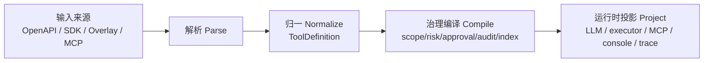

# ACC 工具模型：Agent 调业务能力的统一治理抽象

> [ACC（Agent Capability Contract）](https://www.agentcapability.org) 是面向 Agent 调业务能力的公开能力声明契约，规范仓库为 [agent-capability/agent-capability-contract](https://github.com/agent-capability/agent-capability-contract)；百灵中枢采用 ACC 的开放契约心智，把 OpenAPI `x-agent-capability`、SDK、Overlay、MCP 等输入统一编译成 `ToolDefinition`，再执行白名单、风险、审批、限流、签名和审计。

本文回答三个问题：

1. 传统系统把业务接口开放给 Agent 时，最小不可省的治理要素是什么；
2. 百灵中枢如何把 OpenAPI、SDK 注解、Overlay、MCP 等来源统一成 `ToolDefinition`；
3. 这套模型如何投影给 llm、executor、MCP、控制台和审计系统。

相关文档：

- `docs/ARCHITECTURE.md`：整体七层模型；
- `docs/TOOLS_DESIGN.md`：工具调用签名、审批、审计、威胁模型；
- `docs/CONTRACT.md`：业务系统与中枢的线缆契约；
- `src/core/contracts/tool-definition.ts`：统一工具模型 `ToolDefinition`；
- `src/core/contracts/openapi-tools.ts`：OpenAPI / `x-agent-capability` 到 `ToolDefinition` 的输入编译器；
- `src/core/contracts/tools.ts`：签名、参数快照、运行时治理核心；
- `src/app/tool-context.ts` / `tool-assembly.ts` / `tool-approvals.ts` / `tool-specs.ts` / `tool-proxy.ts`：工具主体与路由配置、运行时装配、审批、spec 刷新、工具代理；
- `src/app/tools-runtime.ts`：工具治理运行面的对外门面；
- `src/services/tools-index.ts`：工具语义检索索引。

## 1. 为什么需要工具模型

大模型只会生成文本，不会天然“操作业务系统”。要让 Agent 具备查订单、建工单、改配置、发通知、查库存、拉报表等能力，业务系统必须把一部分接口按 ACC 声明成 Agent 可调用工具。

这件事不能只做成“给模型一个 URL”。生产环境至少要回答：

- 这个工具叫什么，什么时候该用；
- 这个工具需要哪些参数；
- 它是只读还是会产生副作用；
- 它属于哪个业务能力范围；
- 哪些路由、哪些场景可以用它；
- 当前任务替谁发起操作；
- 这个主体是否有业务权限；
- 调用是否需要进入审批车道；
- 调用失败或重试会不会重复产生副作用；
- 每次调用如何审计和追溯；
- 业务系统如何确认请求确实来自中枢；
- 工具太多时，如何让模型找到合适工具而不把上下文塞爆。

所以工具模型的核心不是“函数调用格式”，而是“Agent 调业务能力的治理抽象”。

## 2. 设计目标

### 2.1 来源可替换

工具可以来自：

- OpenAPI `x-agent-capability` 注解；
- 独立 Agent 工具 OpenAPI spec；
- PHP/Java/Node 等 SDK 注解；
- OpenAPI Overlay；
- MCP server 的 tools/list；
- 手工配置或未来的工具市场模板。

这些都只是输入格式，不应该绑死核心。

### 2.2 内部模型统一

所有输入最终都应归一成 `ToolDefinition`。路由白名单、风险闸、审批、审计、签名、语义检索、控制台展示都只依赖这个内部模型。

### 2.3 输出可投影

同一批工具可以投影给：

- llm function calling；
- executor 认领件里的工具清单；
- `/jobs/:id/tools/invoke` 统一代理；
- MCP server tools/list；
- 控制台工具清单；
- trace 和审计时间线。

### 2.4 治理强制执行

工具声明里的风险、scope、只读、幂等、审批、限流不是给模型看的建议，而是中枢调用出口必须强制执行的规则。

### 2.5 业务保留最终授权

中枢负责 reach，业务负责 authority。

中枢判断这条 Agent 路由最多够到哪些工具；业务系统验签后根据自己的权限表判断这个主体此刻能不能做这个动作。

## 3. 核心模型：ToolDefinition

`ToolDefinition` 已是代码层一等模型。所有工具来源都应先编译成它，再进入运行时治理。

```ts
interface ToolDefinition {
  // 契约版本
  schemaVersion: 'bailing.tool-definition.v1';

  // 身份和来源
  name: string;
  source: 'openapi' | 'overlay' | 'sdk' | 'mcp' | 'manual';

  // 业务语义
  description: string;
  scope: string;
  context: string[];

  // 调用线缆
  method: string;
  path: string;
  inputSchema: Record<string, unknown>;
  paramIn: Record<string, 'query' | 'body' | 'path' | 'header'>;

  // 治理语义
  risk: 'low' | 'medium' | 'high';
  confirmRequired: boolean;
  requiresSubject: boolean;
  readonly: boolean;
  idempotent: boolean;
  sensitive: boolean;
  rateLimitPerMin: number;
  timeoutMs: number;
  confirmPrompt: string;

  // 扩展：中枢保留，但不隐式改变安全闸门
  extensions: Record<string, unknown>;
}
```

字段分组心智：

- 业务语义：给模型理解；
- 调用线缆：给中枢实际调用；
- 治理语义：给中枢强制执行；
- 扩展字段：给不同来源保留原始信息。
- 契约版本：给 SDK、控制台、导入导出和开源生态做演进边界。

## 4. 输入来源

### 4.1 OpenAPI `x-agent-capability`

这是当前最成熟的来源。

优点：

- 传统系统通常已有 HTTP API；
- OpenAPI 能描述 method、path、参数 schema；业务入参不受 `x-agent-capability` 字段表限制，继续用标准 JSON Schema 表达；
- `x-agent-capability` 可补充风险、scope、只读、审批等治理语义；
- 中枢可以自动刷新 spec、比对变更、触发告警；
- 业务接口和 Agent 工具描述可以共用一套事实源。

适用场景：

- 业务 API 清晰；
- 团队愿意在接口上显式标注 AI 治理信息；
- PHP/Java/Node 后端都可用。

边界：

- 不适合把整个业务 OpenAPI 原样暴露给 AI；
- 需要精选 AI 门面接口；
- 需要业务侧补上验签和授权；
- `x-agent-capability` 不能替代业务权限判断；
- ACC 内未知字段会被忽略；operation 上的 `x-bailing-*` / `x-business-*` 可以进入 `extensions`，但只有框架明确解析的字段才能影响 allow/risk/approval/limit/audit/signature。

#### `x-agent-capability` 字段怎么理解

`x-agent-capability` 是 ACC 的 OpenAPI 绑定字段，用来声明 Agent 触达边界，不声明业务审批规则。字段分三类：

| 类别 | 字段 | 运行影响 |
|---|---|---|
| 暴露与白名单 | `x-agent-capability.enabled`、`x-agent-capability.scope` | 不启用不暴露；scope 必须命中路由 allow 才会进工具清单 |
| 风险与执行 | `x-agent-capability.risk.level`、`x-agent-capability.approval.required`、`x-agent-capability.approval.when` | 决定直接调用、参数命中后确认，或进入中枢审批车道 |
| 主体与审计 | `x-agent-capability.subject.required`、`x-agent-capability.audit.sensitive`、`x-agent-capability.execution.rate_limit`、`x-agent-capability.execution.timeout_ms` | 决定无主体是否隐藏、审计是否记录参数值、限流和超时 |
| 模型可用性 | `summary`、`operationId`、参数 schema、`x-agent-capability.guidance.when_to_use`、`x-agent-capability.guidance.returns`、`x-agent-capability.guidance.examples`、`x-agent-capability.execution.readonly`、`x-agent-capability.execution.idempotent` | 决定 Agent 能否选对工具、填对参数、是否可安全重试 |
| 业务扩展 | `x-agent-capability.guidance.context`、`x-bailing-*` / `x-business-*` | 中枢保留和透传，但不隐式改变安全闸门 |

风险等级按“AI 自动触发的最坏后果”判断：

- `low`：轻微副作用、可恢复、影响面小；
- `medium`：有业务副作用，但通常单对象、可回滚，或只是创建业务申请/草稿；
- `high`：资损、删除、权限、人事、合同、批量、跨租户、对外通知、难回滚。

成熟业务系统优先把高风险动作设计成“创建申请/发起流程”工具，让业务审批流承接；中枢审批车道用于 AI 直接碰强副作用接口、业务没有审批能力、或需要 AI 专属确认的场景。

#### 最小接入心智：Agent 只是替用户点同一套业务按钮

开发者不需要一开始把所有 `x-agent-capability` 字段都填满。最快的安全接入路径是：

1. 选一个后台里已经存在、权限已经跑通的动作；
2. 把这个动作背后的 HTTP 接口声明成工具；
3. 在 `x-agent-capability` 里标 `enabled`、`scope`，再写好 `summary` 和参数 schema；
4. 工具接口验签后读取 `X-Bailing-On-Behalf-Of`，走业务系统原有权限表；
5. 按需补 `x-agent-capability.risk.level`、`x-agent-capability.subject.required`、`x-agent-capability.approval.when` 等治理字段。

这意味着：如果业务后台里某个员工能删除员工，Agent 不是获得了一套新权限，而是以这个员工的操作主体发起同一类业务动作；业务侧仍然按原权限表判断能不能删。中枢只负责把“Agent 能看见哪些工具、这次调用来自哪个任务、替谁发起、有没有过风险闸”钉牢并留痕。

所以 `x-agent-capability` 写错通常不会直接绕过业务权限。真正的强边界是业务侧验签 + 授权 fail-closed；ACC 是让 Agent 触达范围更清楚、审计更完整、敏感动作更可控。敏感接口需要认真筛选，但普通查询和已经有权限保护的后台动作，可以按最小路径快速接入。

#### 设计 Agent 工具时优先考虑的接口形态

`x-agent-capability` 字段不应该逼开发者给底层 CRUD 硬套风险等级。更好的做法是先设计一层 Agent 友好的业务门面，再给这层门面加治理声明。

推荐优先级：

| 优先级 | 工具形态 | 示例 | 推荐风险 |
|---|---|---|---|
| 1 | 查询工具 | `order.get`、`staff.search`、`inventory.query` | `low` / `x-agent-capability.execution.readonly:true` |
| 2 | 预检/试算工具 | `refund.preview`、`price_change.estimate`、`employee_delete.impact` | `low` 或 `medium` |
| 3 | 申请/草稿工具 | `refund.request.create`、`employee_remove.request`、`contract_change.draft` | `medium` |
| 4 | 真实执行工具 | `refund.execute`、`employee.delete`、`permission.grant` | 通常 `high` 或 `confirm-required` |
| 5 | 批量执行工具 | `coupon.batch_send`、`price.batch_update`、`staff.batch_disable` | 通常 `high`，并配 `confirm-when` |

设计建议：

- 暴露“业务动作”，不要暴露数据库级 CRUD。`create_refund_request` 比 `update_order_status` 更适合 AI。
- 高风险动作优先拆成“预检 → 申请 → 业务审批后执行”。这样中枢不需要复制业务审批流。
- 对真实执行接口，必须让参数足够具体，不允许 Agent 传任意 SQL、任意 filter、任意表达式。
- 批量工具必须有明确数量上限和筛选条件说明，建议用 `x-agent-capability.approval.when` 对 `count`、`amount`、`tenant_id` 等参数做阈值确认。
- 返回值要让 Agent 能分清“已执行”和“已提交申请”。推荐返回 `status` 与人话 `message`，例如 `pending_approval`、`created`、`done`、`rejected`、`failed`。
- 参数 `description` 比字段名更重要。AI 看到 `id` 不知道是什么，看到“订单号，形如 SO202607...”才会稳定填对。

推荐响应心智：

```json
{
  "ok": true,
  "status": "pending_approval",
  "message": "已提交退款申请，等待主管审核。",
  "business_id": "refund_req_1001",
  "url": "https://business.example.com/refunds/refund_req_1001"
}
```

中枢不会强制业务必须返回这个结构，但这种结构最利于 Agent 正确回复用户，也利于 trace 排障。

### 4.2 Agent 工具专用 spec

业务系统可以维护一份只给 Agent 工具接入使用的 OpenAPI spec，而不是复用对外完整接口文档。

优点：

- 不污染公共 OpenAPI；
- 可以只暴露精选门面；
- 可以把复杂内部接口包装成更适合 AI 的少量工具；
- 更适合老系统和强安全团队。

适用场景：

- 现有 API 太碎；
- 对外 OpenAPI 不能承载 Agent 治理声明；
- 需要专门设计“Agent 友好接口”。

### 4.3 SDK 注解

PHP SDK 当前已经提供注解路径。未来可扩展到其他语言。

优点：

- 开发者在代码旁边声明工具语义；
- 可以生成 Agent 工具专用 spec；
- 可以在构建期做体检，比如描述太短、缺 scope、写接口未标风险；
- 对传统开发者更自然。

适用场景：

- PHP、Java、Node 等后端；
- 团队愿意通过 SDK 标注；
- 希望减少手写 JSON spec。

### 4.4 OpenAPI Overlay

Overlay 用来把 AI 治理信息叠加到既有 OpenAPI 上，而不修改原始 spec。

适用场景：

- 原始 OpenAPI 由网关、平台或其他团队维护；
- 不允许写入 `x-agent-capability`；
- 想让 Agent 治理元数据独立版本管理。

建议定位：

- 作为低侵入输入方式；
- 最终仍然编译成 `ToolDefinition`；
- 不改变运行时治理模型。

### 4.5 MCP tools

MCP 是工具生态的一种线缆。它可以作为输入，也可以作为输出。

作为输入：

- 中枢消费外部 MCP server；
- MCP tool 转成 `ToolDefinition`；
- 中枢给它补充 scope、risk、审批、审计等治理语义；
- 调用仍走中枢统一出口。

作为输出：

- 中枢把内部 `ToolDefinition` 投影成 MCP tools/list；
- 外部 MCP client 可以消费；
- 治理仍在中枢调用面强制，不依赖 MCP hint。

关键判断：

MCP 解决“工具怎么被发现和调用”的线缆问题，不解决“业务系统 AI 操作如何授权、审批、审计”的治理问题。百灵中枢的价值应在治理层。

## 5. 编译管线

建议把工具源处理明确成四段：



### 5.1 Parse

职责：

- 读取来源格式；
- 校验 JSON/YAML/协议结构；
- 提取 method/path/schema/description；
- 保留原始来源 metadata。

当前实现：

- `compileOpenApiTools(specJson)` 从 OpenAPI JSON 编译出 `ToolDefinition[]`，并返回统一的 `diagnostics`；
- `diagnostics` 以 `severity: error | warning | info` 表达编译结果：`error` 表示该 operation 不进入工具清单，`warning` 表示可暴露但接入质量需要优化；
- 控制台如需展示 skipped / warnings，应从 `diagnostics` 派生，不再把它们作为编译器的一等模型。

优化方向：

- 支持 YAML；
- 支持 Overlay merge；
- 支持 MCP tools/list 导入。

### 5.2 Normalize

职责：

- 生成稳定工具名；
- 合并 query/body/path 参数；
- 统一 JSON Schema；
- 填充风险默认值；
- 识别 readonly/idempotent；
- 保留业务自定义 `context/extensions`；
- 对 description 做长度和质量约束。

当前实现：

- `src/core/contracts/tool-definition.ts` 固化了 `ToolDefinition`；
- `schemas/tool-definition.schema.json` 固化了对外机器可读 schema；
- `src/core/contracts/openapi-tools.ts` 已做 operationId、参数合并、风险默认下限、只读/幂等判断，并通过 `tool-annotations` 保留 context/extensions；
- `validateToolDefinition()` 是所有输入编译器共享的 Normalize Gate：候选工具必须通过契约校验才会进入运行时清单；
- 编译结果已统一成 `diagnostics`，其中阻断原因和质量提醒共用一套结构。

优化方向：

- 为 `extensions` 定义尺寸上限、命名规范和控制台展示方式；
- 支持 YAML、Overlay merge、MCP tools/list 导入。

### 5.3 Compile

职责：

- 路由 allow 白名单过滤；
- 主体缺失时锁定 requiresSubject 工具；
- 生成 LLM 可用工具列表；
- 生成 catalog；
- 建工具语义索引；
- 装配审批和幂等账本；
- 准备签名外发所需信息。

当前实现：

- `resolveAllowedTools` 做双闸；
- `buildToolRuntime` 装配运行时；
- `ToolIndexService` 做工具语义检索；
- approval/idempotency/audit 都已接入运行时。

优化方向：

- 把 compile 结果定义成 `ToolRuntimePlan`；
- 把 route 工具配置 schema 固化；
- 把工具锁定原因显式返回控制台；
- 将 tool index 状态持久化展示。

### 5.4 Project

职责：

- 投影成 OpenAI function calling；
- 投影成 executor work item；
- 投影成 MCP tools/list；
- 投影成控制台工具清单；
- 投影成 trace 事件。

当前实现：

- `llmTools`；
- `catalog`；
- `lookup`；
- `retrieve`；
- executor 认领件工具面；
- 控制台工具源清单。

优化方向：

- 增加 MCP projection；
- 控制台展示统一读 `ToolDefinition`；
- trace 记录每次投影给模型的实际工具集合；
- 支持按模型能力裁剪 schema。

## 6. 运行时治理

### 6.1 双闸：声明与路由白名单

工具能被 AI 看见，必须同时满足：

```text
工具源声明 x-agent-capability.enabled
AND
工具 scope 命中对应 route.tools.sources[].allow
AND
如果 requiresSubject=true，则当前 job 有可信主体
```

这能避免“业务系统新增了一个危险接口，AI 自动就能调到”的事故。

### 6.2 风险闸

建议风险分级保持简单：

| 风险 | 语义 | 默认行为 |
|---|---|---|
| low | 只读或安全动作 | 可执行，审计 |
| medium | 有副作用但低风险，或漏标写操作 | 可执行，重点审计 |
| high | 资金、权限、删除、跨租户、不可逆动作 | 进入审批车道 |

当前安全默认：

- GET 默认 low；
- 显式 `x-agent-capability.execution.readonly` 的 POST 查询默认 low；
- 未标 risk 的写操作默认 medium；
- 显式 high 必须进入审批车道。

### 6.3 主体闸

`requiresSubject=true` 的工具在没有操作主体时不暴露。

这对网页匿名访客尤其重要：匿名用户可以问公开知识，但不应该让 Agent 替他调用需要登录身份的业务工具。

### 6.4 审批闸

`risk=high` 或 `confirmRequired=true` 的调用进入审批车道：

1. 中枢冻结调用快照，生成 `ApprovalIntent`；
2. 中枢把审批意图投递给业务侧审批系统、IM/OA 审批流，或内置控制台兜底；
3. 当前任务正常结束为“已提交审批”，不占执行槽；
4. 审批方做业务权限判断，返回 `ApprovalDecision`；
5. 批准后中枢自动重跑；
6. 中枢只放行 tool + args_hash 完全一致的一次调用。

关键边界：

- 审批权属于业务系统，不属于中枢；
- 中枢不维护业务组织关系、审批人权限、审批流规则；
- 中枢只负责识别高风险调用、冻结快照、发出审批意图、接收可信决策、精确放行；
- 中枢内置后台审批页是开发调试、轻量场景和运维兜底，不是生产集成的唯一形态；
- 生产环境推荐业务侧审批：由业务系统决定谁能审、在哪里审、是否多级审批、如何写业务审批日志。

建议的抽象：

```text
ApprovalIntent
  approval_id
  job_id
  route
  subject
  tool
  scope
  risk
  args
  args_hash
  summary
  callback/signature metadata

ApprovalDecision
  approval_id
  job_id
  request_id
  args_hash
  decision_id
  decision: approved | denied
  approver
  comment
  decided_at
```

审批承接方式：

| 模式 | 说明 | 适用 |
|---|---|---|
| business_webhook | 中枢把 `ApprovalIntent` POST 给业务系统，业务系统在自己的审批页/流程里处理，再回调中枢 | 生产推荐 |
| channel_card | 中枢把审批意图推到企微/飞书/钉钉卡片，按钮动作回业务侧或中枢决策接口 | IM 场景 |
| hub_console | 中枢控制台直接 `approved` / `denied` | demo、开发、兜底、无业务审批系统的小团队 |

当前最小协议：

```jsonc
// 路由 tools.approval
{
  "type": "business_webhook",
  "url": "https://business.example.com/ai/approvals"
}
```

中枢投递给业务侧：

```jsonc
{
  "kind": "tool_approval_request",
  "approval_id": 123,
  "job_id": "...",
  "request_id": "...",
  "route": "store_ops",
  "subject": "user_1001",
  "tool": "inventory.adjust",
  "scope": "store.inventory.write",
  "risk": "high",
  "policy": "risk_high",
  "reason": "risk=high",
  "method": "POST",
  "path": "/inventory/adjust",
  "args": { "store_id": 8, "sku_id": 10086, "delta": -20 },
  "args_hash": "...",
  "summary": "将门店 8 的 SKU 10086 库存减少 20",
  "intent": {
    "kind": "tool_approval_intent",
    "schema_version": "bailing.approval-intent.v1",
    "policy": "risk_high",
    "reason": "risk=high",
    "summary": "将门店 8 的 SKU 10086 库存减少 20"
  },
  "decision_path": "/approvals/123/decision",
  "decision_contract": {
    "kind": "tool_approval_decision",
    "schema_version": "bailing.approval-decision.v1",
    "required_fields": ["approval_id", "job_id", "request_id", "args_hash", "decision_id", "decision", "approver"],
    "idempotency": "decision_id",
    "match": {
      "approval_id": 123,
      "job_id": "...",
      "request_id": "...",
      "args_hash": "..."
    }
  },
  "metadata": {}
}
```

业务侧裁决后回调中枢：

```http
POST /approvals/123/decision
Authorization: Bearer <触发方 client token>
content-type: application/json

{
  "kind": "tool_approval_decision",
  "schema_version": "bailing.approval-decision.v1",
  "approval_id": 123,
  "job_id": "...",
  "request_id": "...",
  "args_hash": "...",
  "decision_id": "oa:approval:9001",
  "decision": "approved",
  "approver": "user_2002",
  "comment": "确认处理"
}
```

也可以不带 Bearer，而用与中枢外发回调相同的 `X-Bailing-Timestamp` + `X-Bailing-Signature: sha256=...` 对原始 body 签名。中枢会校验这次决策属于同一个触发方，并强制复核 `approval_id/job_id/request_id/args_hash` 与冻结快照一致；`decision_id` 用于业务侧重试幂等。批准后自动重跑原任务；拒绝则只记录决策，不执行工具。

优化方向：

- 参数级审批条件；
- 业务侧审批 webhook 协议；
- IM/OA 审批卡片 adapter；
- 审批模板和摘要渲染；
- 审批 SLA；
- 审批后 trace 串联。

### 6.5 幂等账本

副作用工具在同一个 job 内，如果相同参数已经成功执行过，重试或崩溃恢复时不应重复发出。

当前逻辑：

- 非只读、非声明幂等的工具进入幂等账本；
- 同 job、同 tool、同 args_hash 命中时返回上次结果；
- 只读/幂等工具每次可重新执行。

### 6.6 签名出口

所有业务工具调用都由中枢统一签名，业务侧验签。

当前签名材料包含：

```text
timestamp
method
path?query
sha256(body)
onBehalfOf
jobId
```

这能防止窗口内重放时篡改主体或任务 ID。

### 6.7 审计

工具调用必须留痕：

- tool；
- scope；
- risk；
- method/path；
- subject；
- job_id；
- 参数摘要或全量；
- 响应状态；
- 耗时；
- 是否截断；
- 是否审批；
- 是否幂等命中。

审计失败应 fail-closed：宁可不放行，也不要让 Agent 操作没有记录。

## 7. 工具太多时怎么办

传统系统接口很多，不能把几百个工具一次性塞给模型。

当前策略：

1. 小于阈值：全量内联；
2. 大于阈值：轻 catalog + `lookup`；
3. 配了 embedding：工具语义检索，按用户意图召回相关工具；
4. lookup 和 retrieve 不计入业务工具调用次数，但要审计。

通用原则：

- route 仍是第一性控制：一条 route 只挂一个场景需要的工具范围；
- 工具检索只能在已过双闸的工具集合内排序；
- 检索不能绕过白名单、主体锁和审批；
- 工具描述首句必须自含语义，否则 catalog 阶段模型找不到。

优化方向：

- 工具描述质量评分；
- 工具分类树；
- 控制台模拟“用户问题 -> 召回工具”；
- trace 记录本次模型实际看到了哪些工具。

## 8. 与 MCP 的关系

MCP 是线缆，不是治理层。

### 8.1 出站 MCP

中枢作为 MCP client，消费外部 MCP server。

价值：

- 复用外部生态工具；
- 外部 MCP 工具也经过中枢 route allow、risk、audit、approval；
- 操作主体仍来自 `/run` 或聊天入口；
- 不破坏现有工具治理模型。

### 8.2 入站 MCP

中枢作为 MCP server，把内部 `ToolDefinition` 投影出去。

价值：

- 业务只维护一份工具模型；
- 外部 AI client 可以消费；
- 中枢仍能保留审计和审批。

风险：

- 外部 MCP client 的用户身份从哪里来；
- OAuth/OIDC 是否要引入；
- 未认证公共 client 不能直接获得高风险工具；
- 审批交互阻抗更高。

建议优先级：

1. 先做出站 MCP：治理外部工具；
2. 再做入站 MCP：投影内部工具；
3. 最后再考虑公开第三方 MCP client 的身份体系。

## 9. 行业适配推演

### 9.1 电商

工具例子：

- `order.read` 查询订单；
- `refund.create` 发起退款；
- `coupon.send` 发优惠券；
- `goods.update` 修改商品描述；
- `store.staff.read` 查门店员工。

治理重点：

- 退款、改价、删商品必须 high；
- 发券可能按金额或数量参数级审批；
- 客服只能查自己租户；
- 业务侧按员工权限表裁决。

### 9.2 SaaS 后台

工具例子：

- `tenant.config.read`；
- `tenant.config.update`；
- `report.query`；
- `ticket.create`；
- `customer.timeline.read`。

治理重点：

- 多租户隔离；
- route allow 不能过宽；
- 查询报表需要预算；
- 修改配置需审批或二次确认。

### 9.3 CRM/OA/ERP

工具例子：

- `customer.read`；
- `contract.summarize`；
- `approval.submit`；
- `inventory.query`；
- `purchase.create`。

治理重点：

- 审批动作和采购动作必须留痕；
- 金额、供应商、组织范围触发参数级审批；
- 文档读取需要敏感字段审计。

### 9.4 运维

工具例子：

- `log.search`；
- `deploy.status`；
- `alert.ack`；
- `script.run`；
- `rollback.create`。

治理重点：

- 默认只读；
- 脚本执行和回滚 high；
- executor 更重要；
- trace 和人审不可省。

## 10. 当前实现映射

| 模型职责 | 当前实现 |
|---|---|
| 统一工具模型 | `ToolDefinition` in `src/core/contracts/tool-definition.ts` |
| 工具契约校验 | `validateToolDefinition` |
| 机器可读 schema | `schemas/tool-definition.schema.json` |
| OpenAPI 编译 | `compileOpenApiTools` in `src/core/contracts/openapi-tools.ts` |
| scope 白名单 | `scopeAllowed` + `resolveAllowedTools` |
| 风险默认 | `deriveRisk` |
| 签名 | `signToolCall` |
| 参数快照 | `argsHash` |
| LLM 工具投影 | `buildToolRuntime().llmTools` |
| 渐进披露 | `TOOL_INLINE_MAX`、`catalog`、`lookup` |
| 工具语义检索 | `src/services/tools-index.ts` |
| 审批车道 | `ApprovalDeps` + `bz_tool_approvals` |
| 幂等账本 | `idempotency` in `ToolRuntimeDeps` |
| spec 自动刷新 | `refreshProviderSpec` |
| executor 统一工具面 | `/jobs/:job_id/tools/invoke` |
| 审计 | `store.appendAudit` |

## 11. 待优化清单

### 11.1 输入编译器扩展

当前已落地 OpenAPI 输入编译器。下一步补 Overlay、SDK annotations、MCP tools/list 输入编译器。

### 11.2 ToolDefinition schema

已落地 `schemas/tool-definition.schema.json`，作为开源框架的公共工具契约：

- 控制台校验；
- API 校验；
- SDK 生成；
- 文档生成；
- MCP projection。

后续优化重点：

- 生成 SDK 类型，避免 SDK 与中枢模型漂移；
- 让 Overlay、MCP、SDK annotations 输入编译器复用同一份 schema；
- 对 `extensions` 做尺寸、命名空间和展示治理。

代码侧已先落地一条轻量 Normalize Gate：`validateToolDefinition()`。它不替代 JSON Schema，而是把运行期真正危险的问题统一打成 diagnostics，例如工具名非法、path 参数没有 schema、`paramIn` 和 `inputSchema.properties` 不一致、版本不匹配等。后续所有输入编译器都应先产出候选 `ToolDefinition`，再过这道门。

### 11.3 Overlay 输入

新增 Overlay merge 管线，允许外部 OpenAPI 不被污染。

### 11.4 MCP 输入和输出

出站优先：

- MCP tools/list -> ToolDefinition；
- 中枢补治理 metadata；
- 调用走统一出口。

入站随后：

- ToolDefinition -> MCP tools/list；
- invoke 仍走中枢代理；
- 明确身份锚。

### 11.5 参数级审批

已落地规则表达（OpenAPI 输入为 `x-agent-capability.approval.when`，运行时模型为 `ToolDefinition.confirmWhen`）：

```json
{
  "x-agent-capability": {
    "version": 1,
    "enabled": true,
    "scope": "refund.request",
    "approval": {
      "when": [
        { "param": "amount", "op": ">", "value": 1000 },
        { "param": "tags", "op": "contains", "value": "sensitive" }
      ]
    }
  }
}
```

初期不是通用规则引擎，而是安全高价值条件集：数值比较、相等/不等、集合包含、存在。规则必须引用工具 JSON Schema 中已声明且有 type 的参数；数值比较只接受 JSON number / integer，其他比较不做字符串强转。调用实参类型不符时中枢拒绝外发，不能静默当作“条件未命中”。规则格式错误会产生 error diagnostics 并跳过工具，避免安全声明静默失效。跨主体、跨租户、组织权限等判断仍应回到业务系统授权层 fail-closed。

参数级审批同样应该生成 `ApprovalIntent`，由业务侧优先承接。中枢只负责判定“这次调用命中了确认条件”并锁定参数快照，不负责判断某个金额、供应商、租户在业务上是否最终允许。

### 11.6 Trace 集成

工具模型应进入 trace：

- 本次 route 暴露了哪些工具；
- 哪些被主体锁定；
- 哪些被 allow 拦掉；
- 模型实际看见哪些工具；
- 模型调用了哪个；
- 风险闸如何判定；
- 审批/幂等/签名/业务响应全过程。

### 11.7 开发者体检

工具源注册时给出 `diagnostics`：

- 描述太短；
- 写接口未标 risk；
- high 工具未配置审批承接方式；
- requiresSubject 工具但 route 无 subject_field；
- scope 太宽；
- 参数 schema 缺描述；
- 授权探针 inconclusive/suspect。

## 12. 对外叙事

建议避免这样说：

```text
百灵中枢支持 OpenAPI `x-agent-capability`，让 Agent 调业务接口。
```

这容易让人误以为只是“某个产品的私有扩展”。

更好的说法：

```text
ACC 是 Agent 能力声明契约，OpenAPI 绑定字段是 x-agent-capability。百灵中枢基于 ACC 建模：可以从 OpenAPI、SDK、Overlay 或 MCP 导入业务能力，统一归一成 ToolDefinition，再对 Agent 可见范围、风险、限流、审批、审计、签名和回放进行强制治理。业务系统保留最终授权。
```

一句话：

```text
ToolDefinition 是业务能力进入 Agent 世界前的统一治理模型。
```
